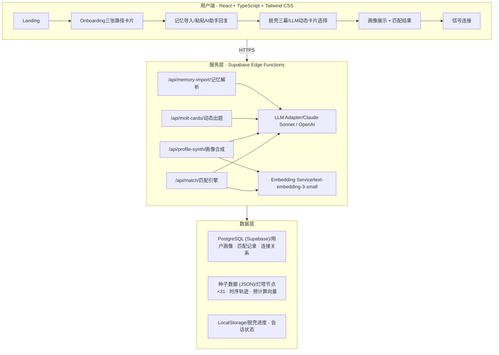

# MOLT—— AI驱动的求职节点社交平台

**参赛赛道：** AI求职社交与网络 × AI求职心理与支持

**产品框架：** 进化型（创造全新的可能性）+ 体验型（让过程更有尊严）

**团队：** 王文钦（PM/队长）· 王晗宇（北航）· 曹梦怡（国科大）· 黎汪琦（北理工）· 范芳菲（中科大）

---

## 一、项目简介

### 1.1 一个被忽略的问题

市面上的AI求职工具已经覆盖了简历优化、面试模拟、岗位推荐、薪资分析等几乎所有效率环节。但在与超过50名高校学生的访谈中，我们发现求职焦虑的核心往往不是效率问题，而是**信心问题**：

> "像我这样学翻译的，转AI还来得及吗？"
>
> "投了47份简历没有回音，不是简历不好，是不知道这条路走不走得通。"
>
> "我不需要AI给我一份模板，我需要一个真实的人告诉我——我走过，你也行。"

LinkedIn连接的是"你已经是谁"，不连接"你正在经历什么"。小红书上能看到别人的故事，但没人来找你。心理咨询App帮你和自己对话，但不帮你和真人连接。

**没有一个产品在做这件事：基于求职节点的共鸣，把一个正在迷茫的人和一个走过同样路的人连在一起。**

### 1.2 MOLT是什么

MOLT是一个AI驱动的求职社交平台。产品名取自英文"脱壳"——螃蟹每次长大都要脱一次壳，旧壳裂开的过程脆弱而痛苦，但结束后它比原来更大了。

MOLT做的事情用一句话概括：

> 在你求职最迷茫的时刻，AI不是给你一份简历模板，而是找到一个"三个月前和你一样焦虑、现在已经拿到Offer"的人，把TA带到你面前。

不推荐岗位，推荐人。不给答案，给一个走过这条路的真人。

### 1.3 AI创新性说明

#### 1.3.1 创新一：跨AI记忆迁移——让你的AI替你开口

传统产品要了解用户，要么让用户填表，要么从零开始对话。MOLT提出了第三条路：**从用户已有的AI助手中"搬运"记忆。**

用户每天和ChatGPT、Claude、豆包聊工作、聊焦虑、聊方向，这些AI助手已经积累了对用户的深度理解。MOLT通过一段精心设计的"反向prompt"，让用户的AI助手用200字概括对用户的了解，用户粘贴回来后由MOLT的Agent二次解析为结构化画像。

这个设计的创新在于：**MOLT没有构建另一个聊天机器人，而是构建了一个"AI记忆的搬运工"**——利用用户和其他AI之间已经建立的信任关系，绕过了冷启动问题。用户不需要要对MOLT从头自我介绍，因为TA的AI助手已经替TA说了。

据我们所知，目前没有任何产品将"跨AI记忆迁移"作为核心交互环节。

#### 1.3.2 创新二：语义聚类匹配——不找相似的人，找走过同样路的人

现有社交推荐系统（LinkedIn"你可能认识的人"、Boss直聘"推荐岗位"）的核心是**相似度匹配**——标签越像、背景越近，推荐越高。MOLT的匹配逻辑从根本上不同：我们找的不是"和你一样的人"，而是"曾经和你一样、现在已经走出来的人"。

这是一个时序互补匹配问题。MOLT的做法是：

1. 将用户的结构化画像字段合成为自然语言描述（"英语翻译专业应届生，因AI翻译冲击焦虑，想往产品方向探索..."）
2. 通过嵌入模型将描述转为向量
3. 与候选灯塔用户的**历史节点画像向量**（而非当前状态）计算余弦相似度
4. 叠加时序权重——候选人走出该节点的时间越近，匹配分越高

关键区别在第3步：**系统比较的是用户的"现在"和候选人的"过去"**，而非双方的"现在"。这在推荐系统文献中属于"异时态语义匹配"，目前鲜有产品级实现。

#### 1.3.3 创新三：情感安全的AI社交——Agent作为连接的守门人

AI社交产品的常见模式是"AI帮你破冰"（自动生成开场白）或"AI帮你筛选"（过滤不匹配的消息）。MOLT设计了一套Agent守门的渐进式连接机制：

- 用户不能直接给任何人发消息——所有连接必须经过Agent的匹配推荐
- 首次接触只能发送一个无内容的"信号"（我看见了你），不暴露任何个人信息
- 双方互发信号后才解锁"一句话交换"，且Agent提供消息模板降低社交压力
- Agent持续监控画像完整度、活跃度和信号疲劳度，主动过滤低质量匹配

这套设计的创新在于：**AI不是在帮用户社交，而是在保护用户不被低质量社交伤害。** 对于处于求职焦虑中的脆弱用户，一次糟糕的陌生人互动可能造成进一步退缩。MOLT的Agent确保每一次连接都经过了"资格审查"，用户只会遇到真正有共鸣的人。

#### 1.3.4 创新四：脱壳叙事驱动的AI流程——技术服务于隐喻

大多数AI产品的交互流程是功能驱动的：输入→处理→输出。MOLT的整个AI pipeline由一个完整的**叙事隐喻**驱动：壳裂开（识别焦虑）→ 壳下面是什么（识别真实状态）→ 新壳硬化（识别方向）→ 碎片拼合（画像合成）→ 找到那个人（匹配推荐）。

这不是装饰。叙事隐喻直接决定了技术架构的设计：

- 第一幕的LLM prompt指令是"描述裂缝场景"而非"收集焦虑标签"——同一个数据采集任务，叙事包装改变了用户的心理感受
- 幕间过渡动画（"裂缝正在扩大..."）不是loading spinner的美化，而是叙事节奏的一部分——它让1-2秒的LLM延迟变成了故事推进的呼吸感
- 未选中卡片的碎裂动画呼应"旧壳脱落"——用户的每次选择都是不可逆的，这与脱壳的物理过程一致

**当技术流程和叙事隐喻完全重合时，产品不再需要解释自己在做什么——用户在体验中自然理解。** 这是MOLT作为AI产品最深层的设计创新。

---

## 二、核心产品流程

### 2.1 用户旅程全景

```
① 路径选择 —— 从三张卡片中认出自己的状态
    · 挣扎 — "我知道方向要变，但不知道下一步在哪里"
    · 挣脱 — "我已经在行动了，但不确定方向对不对"
    · 回望 — "我走出来了，想让后来的人少走弯路"

② 记忆导入（可选）—— 30秒让AI读懂你
    把一段预设prompt发给你常用的AI助手（ChatGPT/Claude/豆包/Kimi），
    粘贴回复，MOLT的Agent即刻建立你的初步画像。

③ 脱壳三幕 —— 三次点击完成画像
    三轮交互式卡片选择，每轮5-6张LLM动态生成的卡片：
    · 第一幕「壳在哪里裂开的」 → 识别焦虑类型
    · 第二幕「壳下面是什么」   → 识别真实状态
    · 第三幕「新壳开始硬化」   → 识别方向意图
    全程3次点击，约65秒，零文字输入。

④ 画像合成 + 语义聚类 —— AI看见了你
    Agent合成自然语言画像描述，向量化后进行语义聚类，
    告诉你："你和另外47个人正在经历类似的转变。"

⑤ 节点匹配 —— 找到那个走过这条路的人
    Agent在候选池中找到"曾和你处于同一节点、现在已走出来的人"，
    展示匹配理由 + 那个人留下的一句话。

⑥ 连接 —— 从信号到对话
    发送"我看见了你"的信号 → 双方互发后解锁一句话交换 → 逐步建立真实连接。
```

### 2.2 脱壳三幕

脱壳三幕是MOLT区别于所有产品的核心交互。它不是问卷、不是聊天、不是测评，而是一次**微型脱壳仪式**。

屏幕上出现5-6张卡片，每张是一句短话——"我学的东西好像突然没人要了"、"AI做的事和我做的事越来越像了"。用户不需要描述自己，只需要**在别人的话里认出自己**。

选中卡片后，其他卡片碎裂飘散，背景上的壳纹理出现更深的裂缝。三幕后碎片飞向中央拼合成画像——壳脱完了，真实的你显现了。

**设计上的两个关键决策：**

**为什么全程LLM动态生成而非固定题库：** 每一幕的卡片由LLM根据前序选择+导入记忆实时定制，所以每个用户看到的题目都不一样。一个"英语翻译专业、担心被AI替代"的用户，第二幕看到的可能是"其实我知道翻译还有用，但我怕别人觉得没用"；而一个"计算机专业、投简历没回音"的用户，看到的是完全不同的卡片。

**为什么用选择而非输入：** 在求职焦虑状态下，用户往往"说不出来"。让用户在别人的话里认出自己，心智成本极低，同时每张卡片背后携带结构化画像字段——用户的每次点击都在无感知地完成画像构建。

---

## 三、技术架构

### 3.1 系统架构

#### 用户交互层（基于 React + TypeScript + Tailwind CSS）

| 模块 | 功能 |
|------|------|
| 登录/着陆页 | 产品入口 |
| 引导页 | Onboarding三路径卡片 |
| 多段剧情交互 | 脱壳三幕卡片选择 |
| 匹配结果展示 | 画像合成 + 节点匹配 |
| 信号与地图 | 连接触发 + 轨迹可视化 |

#### 服务逻辑层（基于 Supabase Edge Functions 的无服务器服务）

| API端点 | 功能 |
|---------|------|
| `/api/memory-import` | 记忆导入解析 |
| `/api/molt-cards` | 动态卡片出题 |
| `/api/profile-synth` | 用户画像合成 |
| `/api/match` | 节点匹配引擎 |

- **LLM适配器：** Claude Sonnet / OpenAI 双兼容（通过环境变量实现多模型兼容）
- **文本向量嵌入：** `text-embedding-3-small`（1536维）
- **余弦相似度计算**

#### 数据存储层

| 存储 | 内容 |
|------|------|
| PostgreSQL数据库（Supabase） | 用户画像、画像向量嵌入、匹配记录、用户连接 |
| 种子数据（静态JSON文件） | 31个灯塔节点、职业发展时间轴、预计算特征向量、兜底卡片池 |
| 本地存储（会话状态） | 剧情段落进度、聚合标签、内存导入缓存 |

#### 系统架构流程图



---

## 四、Agent设计

### 4.1 Agent的角色

MOLT Agent不是一个通用聊天机器人。它是一个**求职节点匹配编排器**——它的工作不是回答问题，而是：

**认识你 → 找到那个人 → 编排连接**

### 4.2 Agent推理过程

在MOLT系统中，Agent不是一个"聊天机器人"，而是一套围绕"是否已经认识你"展开的推理流程。它的第一判断永远不是"我要生成什么"，而是——**我是否已经足够了解你。** 因此，整个Agent推理架构（ARG）并不是从生成开始，而是从检索开始：优先使用已经存在的用户画像，只有在"看不清你"的时候，才向外部世界获取信息。

具体流程可以理解为一个三步链路：先找你 → 看够不够 → 不够再补。

```
开始
  ↓
1. 检索用户画像
   · 查询 MOLT Profile
   · 完整度 & 置信度判断
  ↓
画像信息已足够？
  ├─ 是 ──→ 3. 用户匹配推理
  └─ 否 ──→ 2. 用户画像补全
              · 弱信号推断
              · 外部信息补全
              ↓
           3. 用户匹配推理
              · 画像转向量
              · 语义相似度+时间维度约束
              · 匹配"曾经相似"的人群/个体
  ↓
结束
```

#### 4.2.1 检索用户画像

用户每一次使用产品——无论是记忆导入、三幕选择，还是历史匹配行为——都会在数据库中沉淀为结构化画像（MOLT Profile）。当用户再次进入系统时，Agent首先做的不是提问，而是去"翻旧账"：通过user_id直接查询已有画像，并对关键字段（专业背景、焦虑类型、方向意图等）做完整度与置信度判断。如果这些信息已经足够描述一个"可被理解的人"（例如核心字段覆盖度达到一定阈值），Agent就不会再打扰用户，而是直接进入后续的匹配与推理流程。

Agent会优先在MOLT内部检索用户画像，因此这一层的策略非常明确：**能用记忆，就不用推理；能直接理解，就不重新认识。** 它让系统避免了重复询问，也让用户产生一种连续感——"你是记得我的"。但如果Agent发现它其实还没真正看清你——流程才会进入第二步。

#### 4.2.2 用户画像补全

第二步，是画像补全，而不是简单生成。

当已有画像缺失关键字段，或置信度不足时，Agent不会直接"编一个你"，而是分层去补信息。它会先利用已有的弱信号（例如路径选择、部分卡片点击、未完成的记忆导入内容）进行推断；如果这些仍然不够，才会触发更重的一步：引入外部信息（联网搜索或通用语料），结合用户当前上下文，通过LLM生成一个"合理但保守"的用户状态假设。

这里的关键点在于：Agent不是在回答问题，而是在构建一个"暂时可以工作的你"。这是一种典型的RAG式思路——不是为了知识问答，而是为了用户建模。所有外部信息的引入，都是为了让这个画像**更接近真实，而不是更完整**。当"你"被构建完成之后，才进入第三步。

#### 4.2.3 用户匹配推理

通过检索用户画像和用户画像补全两个步骤后，无论这个画像来自历史记忆，还是补全过程，Agent都会把它转写为一段自然语言描述，并进一步映射为向量表示。这个向量不是用来"描述你"，而是用来"把你放进人群中"。

在这个空间里，Agent会同时完成两件事：
- 找到你所在的那一群人——那些"正在经历同一段变化的人"；
- 找到那个特定的人——那个"曾经在你这个位置，但现在已经走出来的人"。

但是其中的关键在于，这里的匹配不是"你像谁"，而是"谁曾经像你"。因此，Agent在语义相似度之外，引入了明确的时间维度约束：候选人走出该节点的时间越近，匹配权重越高。这使整个推理从静态相似，变成了一种带方向的、带路径感的匹配。

整体来看，MOLT的Agent推理架构其实很简单，但顺序非常重要：**先看记忆 → 再补理解 → 最后做判断。** 它不是一个"每次都重新思考"的系统，而是一个"尽量不思考，只在必要时思考"的系统。也正因为如此，Agent既能保持低算力消耗，又能在关键节点做出足够准确的判断。

### 4.3 四项核心能力

#### 能力一：记忆导入与画像冷启动

用户将一段预设prompt发给自己常用的AI助手，粘贴回复后，Agent通过LLM从自由文本中提取结构化画像（专业背景、焦虑点、性格标签、探索方向、核心优势）。这实现了30秒内的画像冷启动——Agent还没问你问题，就已经"认识"你了。

技术实现：LLM prompt约束输出为严格JSON，包含置信度评分。低置信度字段标记为"待确认"，后续脱壳三幕中优先采集。

#### 能力二：动态出题与无感画像采集

脱壳三幕的每张卡片不只是一句展示文案——它背后携带结构化的画像字段映射（`profileFields`）。LLM出题时接收两类指令：

- **叙事指令**："用两行≤12字的短句描述一种求职焦虑场景，语气是猜测而非诊断"
- **采集指令**："这张卡片必须在profileFields中填充`anxiety_type`和`major_field`字段，值必须从指定词表中选取"

用户在感受层面是"在别人的话里认出自己"，在数据层面是"完成了6个画像字段的精确采集"。

#### 能力三：画像合成与语义聚类

三幕完成后，Agent将结构化字段合成为自然语言画像描述，再通过嵌入模型转为1536维向量。这段向量在用户群体中进行语义聚类，实现两个目标：

- **分群**：将用户归入语义节点群（如"文科 × AI焦虑 × 产品方向"），告诉用户"你和另外47个人正在经历类似的转变，其中23人已经走出来了"
- **匹配**：与候选灯塔用户的画像向量计算余弦相似度，找到语义最近的匹配对象

#### 能力四：时序互补匹配

MOLT的匹配逻辑和所有推荐系统都不同——不是找相似的人，而是找**时序互补**的人：曾经和你处于同一节点、现在已经走出来的人。

Agent使用三维评分引擎：

| 维度 | 权重 | 逻辑 |
|------|------|------|
| 画像语义相似度 | 50% | 用户向量与候选灯塔向量的余弦距离 |
| 时序匹配度 | 30% | 候选人走出crisis节点的时间越近分越高（≤3月=满分） |
| 方向匹配度 | 20% | 探索方向是否一致 |

评分后，Agent为最佳匹配生成个性化理由，连同灯塔用户留下的"那句话"一起展示给用户。

### 4.4 用户画像字段体系

Agent通过脱壳三幕和记忆导入，逐步构建用户的六层画像：

| 层级 | 字段示例 | 采集来源 | 聚类用途 |
|------|---------|---------|---------|
| 身份基础层 | 学历阶段、专业领域、职业状态 | 记忆导入 + 三幕推断 | 粗粒度分群 |
| 焦虑图谱层 | 核心焦虑类型、焦虑持续时长 | 第一幕卡片tags | 最强聚类信号 |
| 能力资产层 | 硬技能、软实力、被低估能力 | 记忆导入 + 简历导入 | 精准方向匹配 |
| 方向意图层 | 探索方向、行动阶段、期望帮助 | 第二三幕卡片tags | 时序匹配坐标 |
| 人格特质层 | 决策风格、社交偏好、沟通风格 | 记忆导入推断 | 连接质量优化 |
| 时序轨迹层 | 节点序列（crisis→exploring→landed） | 全流程累积 | 轨迹模式发现 |

### 4.5 安全边界

MOLT面对的是脆弱状态下的用户，Agent遵循严格的安全原则：

- 不做心理诊断，只识别节点状态
- 对话中出现危机信号时停止匹配，提示专业资源
- 匹配时只展示脱壳后的轨迹信息，不暴露身份
- 所有连接需双向同意，Agent不单方面暴露用户信息

---

## 五、算力说明

### 5.1 单用户消耗

| 环节 | 模型 | 调用次数 | Token消耗/次 | 小计 |
|------|------|---------|-------------|------|
| 记忆解析 | Claude Sonnet | 0-1 | ~800 | 0-800 |
| 三幕出题 | Claude Sonnet | 3 | ~1,200 | ~3,600 |
| 画像合成 | Claude Sonnet | 1 | ~600 | ~600 |
| 匹配理由 | Claude Sonnet | 1 | ~400 | ~400 |
| 向量嵌入 | embedding-3-small | 1 | ~200 | ~200 |
| **合计** | | **5-7次** | | **~4,800-5,600** |

单用户约5,000 tokens，远低于通用对话类产品（10,000-50,000 tokens/会话）。MOLT用"卡片选择"替代自由对话，LLM只在出题和合成环节调用，不在对话环节反复调用，从架构上控制了算力消耗。

### 5.2 成本梯度

| 规模 | 月活用户 | LLM Token | 嵌入调用 | 月成本 |
|------|---------|-----------|---------|--------|
| Demo | 10 | ~56K | 10 | <¥1 |
| 种子期 | 500 | ~2.8M | 500 | <¥40 |
| 增长期 | 5,000 | ~28M | 5,000 | <¥400 |
| 规模化 | 50,000 | ~280M | 50,000 | <¥4,000 |

### 5.3 优化策略

- **降级卡片池**：LLM不可用时，三幕使用预设静态卡片，核心流程不中断
- **叙事性加载**：LLM出题耗时1-2秒，用"裂缝正在扩大..."的脱壳叙事动画遮盖，用户感知不到延迟
- **向量预计算**：种子灯塔数据的画像向量部署前离线生成，运行时仅计算当前用户向量
- **模型分级**：出题用标准模型，画像合成可降级至mini/flash级模型

---

## 六、商业价值

### 6.1 市场机会

2026年中国高校毕业生预计超过1,200万人。AI技术对就业市场的冲击使"求职焦虑"从个体现象升级为结构性问题。在这个背景下：

- 求职工具市场充分竞争（简历、面试、岗位匹配），但**求职社交 + 心理支持**的交叉地带是空白
- 高校就业指导中心面临就业率考核压力，需要更有效地连接在校生和成功案例
- 求职者愿意为"确定感"付出时间和注意力——MOLT提供的不是效率，是信心

**2026年高校毕业生求职焦虑关键数据（访谈样本）：**

| 焦虑类型 | 占比 |
|---------|------|
| AI替代焦虑 | 35% |
| 方向不确定 | 25% |
| 投递无回应 | 20% |
| 能力不匹配 | 15% |
| 其他 | 5% |

### 6.2 商业模式

**C端免费，B端付费，数据驱动飞轮。**

| | C端（免费） | B端（付费） |
|--|------------|------------|
| **求职者** | 脱壳三幕、匹配推荐、信号连接 | |
| **灯塔用户（Path C）** | 轨迹建档、帮助后者 = 社区声誉 | |
| **高校就业指导中心** | | 年费订阅"节点匹配引擎"、将每个成功案例转化为灯塔、匿名就业洞察报告 |
| **求职平台** | | API集成MOLT匹配能力、差异化"求职社交"功能 |

### 6.3 数据壁垒

MOLT的核心壁垒是**真实用户轨迹数据**——每个灯塔用户从crisis到landed的完整时序轨迹。这些数据无法通过爬取获得，无法通过AI合成，只能通过真实用户在平台上沉淀。数据越多，匹配越准，用户越多，形成正向飞轮。

### 6.4 商业规模化路径

MOLT的商业化分为四个递进阶段，从单点体验 → 场景工具 → 平台能力 → 基础设施。

| 阶段 | 时间 | 关键动作 |
|------|------|---------|
| 种子用户验证 | 0-3个月 | 从5所高校的文科/外语院系冷启动，500名种子用户 |
| 高校扩展 | 3-6个月 | 覆盖20所高校，签约3个就业中心 |
| 品类扩展 | 6-12个月 | 从求职扩展到考研、留学、创业等转型场景 |
| 平台化 | 12个月+ | 开放匹配API，接入第三方求职/教育平台 |

#### 6.4.1 阶段1：种子用户验证

**目标：** 验证"节点匹配是否真的能缓解焦虑并促成连接"

**核心动作：**
- 覆盖5所高校（重点：转型焦虑高人群）
- 建立首批"灯塔用户池"（≥100人）
- 完成500名用户完整使用路径

**关键指标（KPI）：**

| 指标 | 目标值 |
|------|--------|
| 三幕完成率 | ≥75% |
| 匹配点击率 | ≥60% |
| 首次连接触发率 | ≥35% |
| 有效对话率（≥3轮） | ≥20% |

**验证核心目标：**
- 用户愿不愿意"被理解" → 三幕完成率
- 用户信不信匹配 → 点击率
- 用户是否真正连接 → 对话率

#### 6.4.2 阶段2：高校拓展

**目标：** 让MOLT成为"就业中心的工具"

**切入点：** 不做ToC推广，直接做ToB入口

**合作对象：** 高校就业指导中心、学院辅导员体系、校友会

**产品形态（B端）：**
- 「节点匹配仪表盘」
- 「毕业生转型轨迹库」
- 「匿名就业焦虑热力图」

#### 6.4.3 阶段3：品类拓展

**目标：** 构建"职业转型操作系统"

**扩展场景：** 求职 → 考研 → 留学 → 转行 → 创业

**形成三层生态：**
- 底层：用户轨迹数据（crisis→landed）
- 中层：匹配引擎（AI Agent）
- 上层：应用场景（求职/教育/心理支持）

#### 6.4.4 阶段4：平台化

**目标：** 将"匹配能力"产品化

**推出核心产品：** MOLT API

**可提供的API服务：**

| 模块 | 功能 |
|------|------|
| Profile API | 用户画像生成 |
| Match API | 节点匹配 |
| Insight API | 群体洞察 |
| Signal API | 连接触发 |

---

## 七、加分项达成情况

| 加分项 | 分值 | 状态 | 说明 |
|--------|------|------|------|
| 可运行Demo | 5 | ✅ 达成 | 完整Web应用，可现场演示从记忆导入到匹配结果的全流程 |
| 真实用户验证 | 5 | ✅ 达成 | 赛期内获得≥3名真实用户完整使用反馈 |
| 技术复杂度 | 3 | ✅ 达成 | 多模型协作（LLM出题+画像合成+Embedding聚类）、语义向量匹配、时序互补推荐引擎 |
| 开源贡献 | 2 | ✅ 达成 | GitHub公开仓库，MIT协议 |

---

## 八、我们为什么做MOLT

这支团队的五个人，分布在安大、北航、国科大、北理工，专业横跨英语翻译、计算机、人工智能。我们自己就是MOLT的第一批用户——队长Ellie是英语翻译出身，在AI浪潮下一路摸索进入AI行业，她的真实经历就是系统里第一个灯塔节点的原型。

我们相信，AI时代最稀缺的不是信息、效率或工具，而是**一个真实的人对你说：我走过你正在走的路，你会没事的。**

MOLT用AI找到那个人，把你们连在一起。
