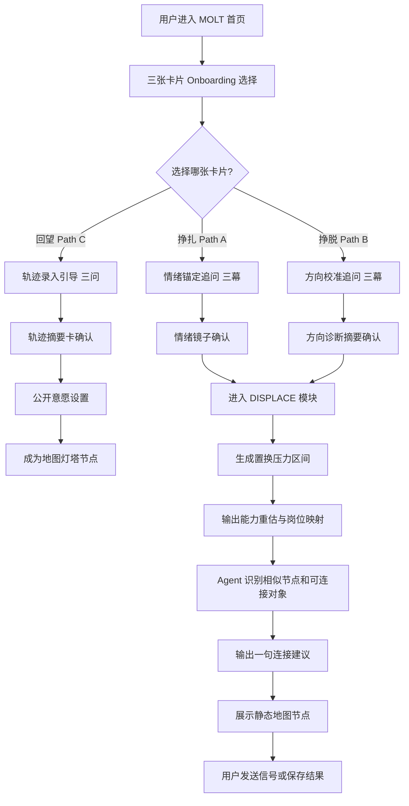
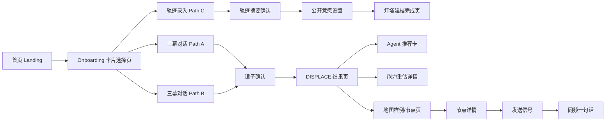

# MOLT（脱壳）- 产品需求文档（PRD）

## 0. 文档信息

### 0.1 文档状态

- **当前版本**: `v2.13 Full`
- **当前阶段**: `需求完善 / Hackathon Demo 开发中`
- **创建人**: `王文钦 Ellie`
- **创建日期**: `2026-03-19`
- **最后更新**: `2026-03-20`
- **核心干系人**: `产品、前端、后端、AI工程、设计、测试、路演/运营负责人`

---

### 0.2 更新记录

| 版本号 | 版本状态 | 更新人 | 更新日期 | 核心更新内容 |
| ------ | -------- | ------ | -------- | ------------ |
| 0.1 | 概念草稿 | 王文钦 Ellie | 2026-03-19 | 完成产品愿景、用户痛点、三层架构、MVP范围定义 |
| 1.0 | 需求初稿 | Codex | 2026-03-19 | 按标准 PRD 模板重构文档，补充背景、目标、用户故事、需求列表 |
| 2.0 | 开发交付稿 | Codex | 2026-03-19 | 补充功能流程、边缘 Case、非功能需求、埋点、上线与灰度计划 |
| 2.1 | 评审修订稿 | Codex | 2026-03-19 | 根据评审收窄 Hackathon MVP、补充 AI 降级、外部数据方案、接口契约与技术选型 |
| 2.2 | 配套文档补全稿 | Codex | 2026-03-19 | 补充立项说明、交互原型、UI 设计说明、技术方案文档，并更新引用 |
| 2.3 | 评审闭环修订稿 | Codex | 2026-03-19 | 修正技术栈残留表述，补充评审问题 closure 文档 |
| 2.4 | 技术栈调整稿 | Codex | 2026-03-19 | 按当前方案保留 Redis 表述，并维持其为非本轮必须组件 |
| 2.5 | 决策口径统一稿 | Codex | 2026-03-19 | 清理执行层面的模糊措辞，统一做与不做的决策表达 |
| 2.6 | AI 服务兼容稿 | Codex | 2026-03-19 | 将 AI 服务调整为 Claude API 与 OpenAI API 双兼容方案 |
| 2.7 | AI Provider 配置稿 | Codex | 2026-03-19 | 明确通过 .env 统一配置 AI Provider、API URL、API Key 与模型 |
| 2.8 | Agent LLM 边界稿 | Codex | 2026-03-19 | 明确 Agent 哪些步骤调用 LLM，哪些步骤使用规则与工具完成 |
| 2.9 | Agent 配置化评分稿 | Codex | 2026-03-19 | 将 Agent 从硬编码打分改为配置化特征评分与 Top K rerank |
| 2.10 | Function Calling 设计稿 | Codex | 2026-03-19 | 补充 Agent 的 LLM 可调用 tools、schema 与调用顺序 |
| 2.11 | Orchestrator 收敛稿 | Codex | 2026-03-19 | 移除动态 tool calling，统一为手写 orchestrator + 内部工具 + LLM 任务 |
| 2.12 | 评审对齐修订稿 | Codex | 2026-03-19 | 对齐 R007 状态、收敛 Agent 命名、补充终端详细日志要求与开发优先级说明 |
| 2.13 | Onboarding 三路径集成稿 | 王文钦 Ellie | 2026-03-20 | 集成三张卡片选择式 Onboarding 设计，补充 Path A/B/C 差异化交互逻辑、镜子专属版本、Agent 匹配专属文案、埋点事件与接口字段 |

---

### 0.3 相关文档

- **市场调研报告**: `本轮不做`
- **竞品分析文档**: `本轮不做`
- **用户研究/访谈纪要**: `本轮不做`
- **项目立项书**: `MOLT_Hackathon_Project_Charter.md`
- **Onboarding 交互设计**: `MOLT_Onboarding_Design.md`
- **交互原型**: `MOLT_Interaction_Wireframes.md`
- **UI设计稿**: `MOLT_UI_Design_Guide.md`
- **数据埋点需求文档**: `本 PRD 第 3.5 节`
- **技术方案设计文档**: `MOLT_Technical_Design.md`

---

### 0.4 名词解释

| 术语 | 解释 |
| ---- | ---- |
| **MOLT** | 产品名，意为"脱壳"，指人在身份转变中的重塑过程 |
| **身份过渡期** | 用户因 AI 冲击、专业失配、职业转向等进入的不稳定阶段 |
| **三张卡片** | Onboarding 第一屏的选择式入场设计，用户通过认出自己完成路径分流 |
| **挣扎（Path A）** | 第一张卡片对应的用户状态：知道方向要变但不知道下一步在哪里 |
| **挣脱（Path B）** | 第二张卡片对应的用户状态：已经在行动但不确定方向是否正确 |
| **回望（Path C）** | 第三张卡片对应的用户状态：已走出过渡期，愿意将轨迹留给后来者 |
| **DISPLACE** | 产品中的"冲击式入口与能力重估"模块，用于识别用户所受结构性压力并输出解读 |
| **Signal（信号）** | 替代点赞的轻互动行为，表示"我看见了你" |
| **同频** | 双方互发信号后，系统允许交换一句结构化短消息 |
| **Agent 匹配** | AI 基于节点、轨迹、城市、方向等条件为用户主动编排连接对象 |
| **时间胶囊** | 对用户当前状态做一次快照，并在未来指定时间回访其变化 |
| **镜子确认** | 用户完成三幕自白后，系统用用户自己的语言复述画像，用户确认"这就是我"后进入下一层 |
| **灯塔节点** | Path C 用户在地图上形成的公开轨迹节点，供 Path A 用户匹配参考 |

---

## 一、需求背景与目标

### 1.1 项目概述

MOLT 是一个面向 AI 时代身份过渡期年轻人的社交社区平台。它以 AI 作为识别和编排系统，以真实用户轨迹作为内容核心，帮助用户从"我被时代替代了吗"的焦虑，走向"有人和我经历过同样的变化，并且我可以继续前进"的确认。

产品通过三张卡片完成用户状态分流，将体验分为三条差异化路径：Path A（挣扎）承接情绪、Path B（挣脱）校准方向、Path C（回望）录入轨迹并成为灯塔。

---

### 1.2 要解决的核心问题（Problem Statement）

- **目标用户画像**:
  1. 因 AI 冲击而对专业、能力、职业方向产生不确定感的在校生与应届生（对应 Path A）
  2. 正在尝试迁移方向、需要同类反馈与现实验证的探索型用户（对应 Path B）
  3. 已完成转型、愿意公开真实轨迹并帮助后来者的前辈型用户（对应 Path C）
- **用户场景（Scenario）**:
  1. 用户在求职受挫、专业被质疑、行业缩招、技能贬值时，需要一个能承接情绪又能指向现实行动的产品
  2. 用户并不只想获得一个"建议答案"，而是想知道"是否有人和我一样"以及"他们后来去了哪里"
  3. 用户需要连接真实的人与真实的市场变化，而不仅仅是消费内容或与大模型单轮对话
- **核心痛点（Pain Point）**:
  1. **身份认同受损**: 用户面对专业缩招、岗位收缩、AI 替代讨论时，首先崩塌的往往不是技能，而是"我是谁、我还能去哪里"
  2. **现有产品只提供信息，不提供连接**: 小红书、LinkedIn、咨询类 App、大模型都能给内容，但不能基于同类经历形成持续关系
  3. **缺乏真实轨迹与外部证据**: 用户需要看到真实他人如何迁移，也需要结合实时岗位、技能热度等外部数据重新理解自己
  4. **传统社交门槛高且无结构**: 陌生人即时聊天成本高、质量低，容易让脆弱状态下的用户进一步退缩

---

### 1.3 用户故事（User Stories）

- **故事一（Path A）**: 作为一名**被 AI 冲击的应届毕业生**，我想要**用一种不被审判的方式说出自己的困惑**，以便于**先确认我的问题是具体且被看见的**
- **故事二（Path B）**: 作为一名**正在转方向的学生**，我想要**看到与我处在相似节点的人后来走向了哪里**，以便于**判断自己不是孤立个体，并获得现实参考**
- **故事三（Path C）**: 作为一名**已经完成转型的前辈**，我想要**公开自己的过渡轨迹并对后来者发出信号**，以便于**让经验以更真实、更有温度的方式被复用**
- **故事四（Path A/B）**: 作为一名**处在高压状态下的用户**，我想要**被系统告诉哪些压力来自结构，哪些问题需要我自己行动**，以便于**减少无效自责并找到下一步**
- **故事五（Path A/B）**: 作为一名**愿意与陌生人交流但不想陷入低质量社交的人**，我想要**在被精准匹配后只交换一句高质量的话**，以便于**降低社交负担并提高连接质量**

---

### 1.4 项目目标与价值

- **用户价值**:
  1. 帮助用户把模糊焦虑转译为可识别的节点、压力与能力
  2. 让用户看到真实同类人的迁移路径，降低孤独感
  3. 用结构化低门槛连接，替代无目的闲聊
- **商业价值**:
  1. 建立基于真实轨迹和持续状态变化的独特数据资产
  2. 形成"AI + 社交 + 实时外部数据"的差异化产品壁垒
  3. 在青年转型、职业变化、情绪承接等交叉赛道中占据新入口
- **项目目标（SMART 原则）**:
  - **[S] Specific（具体）**: 完成 Hackathon MVP，优先打通"卡片选择 -> 三幕自白 -> 镜子确认 -> 置换压力区间 -> Agent 匹配文案"的最小演示闭环
  - **[M] Measurable（可衡量）**: Demo 用户完成三幕自白率 >= 60%，镜子确认率 >= 50%，核心链路生成成功率 >= 90%
  - **[A] Achievable（可实现）**: 基于 Next.js + React + Tailwind CSS + PostgreSQL + Redis + Claude API/OpenAI API + 预生成样本兜底，能够完成 Demo 级稳定交付
  - **[R] Relevant（相关）**: 与产品核心定位"帮助 AI 时代年轻人完成身份迁移"高度一致
  - **[T] Time-bound（有时限的）**: 在 `2026-03-20` 路演前完成 MVP 交付并具备稳定演示能力

---

### 1.5 需求范围

- **In-Scope（范围内）**:
  1. **三张卡片 Onboarding 选择式入场**（挣扎 / 挣脱 / 回望）
  2. 基于路径分流的差异化三幕入口对话与镜子确认
  3. 基于自白与外部岗位趋势的置换压力指数（Path A/B）
  4. Agent 匹配输出一句高质量连接文案（Path A/B，匹配对象类型不同）
  5. Path C 轨迹录入、摘要确认与公开意愿设置
  6. 能力重估结果展示，包括贬值能力、被低估能力、岗位与薪资映射
  7. Demo 级地图可视化，使用预填充静态节点数据
  8. 基础埋点、异常兜底和演示脚本
- **Hackathon MVP 核心路径（必须跑通）**:
  1. 三张卡片选择（Path 分流）
  2. 三幕自白（Path A/B 差异化追问）
  3. 镜子确认（Path A/B 差异化复述）
  4. 置换压力区间与结构性/个体性拆解
  5. Agent 匹配一句话文案
- **Hackathon 加分项（按当前方案直接实现）**:
  1. 能力重估卡片
  2. 地图节点可视化
  3. 信号功能雏形
  4. Path C 灯塔建档流程
- **Out-of-Scope（范围外）**:
  1. 完整即时通讯系统
  2. 大规模真实用户审核、举报、风控体系
  3. 长周期社区运营机制和积分体系
  4. 完整的招聘平台正式 API 商业接入
  5. 多端原生 App 发布
  6. 复杂推荐算法和长期留存策略

---

### 1.6 需求列表（Requirements List）

| 需求ID | 模块 | 需求描述 | 优先级 | 状态 | 备注 |
| ------ | ---- | -------- | ------ | ---- | ---- |
| R000 | Onboarding 卡片 | 用户通过三张卡片完成路径选择（挣扎/挣脱/回望） | 高 | 开发中 | 所有后续流程的分流入口 |
| R001 | 入口对话 | 用户可通过开放式输入完成三幕自白（Path A/B 差异化追问） | 高 | 开发中 | 核心入口 |
| R002 | 镜子确认 | 系统用用户原话复述画像并提供确认入口（Path A/B 镜子内容不同） | 高 | 开发中 | 决定是否进入 DISPLACE |
| R003 | 压力指数 | 系统输出置换压力区间及结构性/个体性拆解（Path A/B 拆解语气不同） | 高 | 开发中 | 必须有 |
| R004 | Agent 匹配 | 为用户生成一条基于真实节点的连接推荐（Path A 匹配灯塔，Path B 匹配先行者） | 高 | 开发中 | 核心闭环 |
| R005 | 能力重估 | 系统输出贬值能力、低估能力与岗位映射 | 中 | 开发中 | 使用预生成内容 |
| R006 | 实时地图 | 将用户节点与转型轨迹可视化展示 | 中 | 开发中 | 使用静态节点数据 |
| R007 | 信号功能 | 用户可向其他节点发送"我看见了你"信号 | 中 | 开发中 | 前端本地状态 Mock |
| R008 | 同频一句话 | 互发信号后允许交换一句结构化消息 | 低 | 规划中 | 非路演必须 |
| R009 | 时间胶囊 | 用户可封存当前状态并在未来查看变化 | 低 | 规划中 | 后续版本 |
| R010 | 外部数据接入 | 接入招聘趋势/GitHub Trending 等外部数据 | 中 | 规划中 | Demo 先采用手工快照数据集 |
| R011 | Path C 轨迹建档 | Path C 用户完成轨迹录入、摘要确认与公开意愿设置，成为灯塔节点 | 中 | 开发中 | Hackathon 加分项 |

---

## 二、方案概述

### 2.1 核心业务流程图（Business Flow）



**图注**: 核心流程在 Onboarding 卡片选择后分为三条路径。Path C 不进入 DISPLACE，直接进入轨迹建档流程并成为灯塔。Hackathon 路演优先演示 Path A 完整链路。

---

### 2.2 核心功能流程图（Function Flow）



**图注**: 产品主要页面围绕"卡片分流、差异化对话、分析、连接、地图"五个层级组织。Path C 单独成一条轻量建档链路，不经过 DISPLACE。

---

### 2.3 信息架构图（IA）

- **首页 / Landing**
  - 产品宣言
  - 开始入口按钮
  - 产品价值说明
- **Onboarding 卡片选择页**
  - 卡片一：挣扎（Path A）
  - 卡片二：挣脱（Path B）
  - 卡片三：回望（Path C）
  - 兜底入口：「都有一点，但又不完全是」→ 默认进入 Path A
- **入口对话页（Path A）**
  - 第一幕：情绪锚定（具体时刻）
  - 第二幕：动态追问（嵌入用户原话）
  - 第三幕：连接需求识别
  - 镜子确认（情绪镜子版）
- **入口对话页（Path B）**
  - 第一幕：方向描述
  - 第二幕：动态追问（校准信号）
  - 第三幕：需求类型选择（数据 / 人）
  - 镜子确认（方向诊断摘要版）
- **轨迹录入页（Path C）**
  - Q1：过渡前在哪里
  - Q2：转折是怎么发生的
  - Q3：对六个月前的自己说一句话
  - 轨迹摘要卡确认
  - 公开意愿设置
  - 灯塔建档完成页
- **DISPLACE 结果页（Path A/B）**
  - 置换压力区间
  - 结构性压力 / 个体性问题拆解
  - 数据来源说明
  - Agent 推荐文案
- **能力重估页**
  - 正在贬值的能力
  - 被严重低估的能力
  - 岗位方向与薪资区间
  - 本周最小行动建议
- **实时地图页**
  - 节点分布
  - 相似人群聚类
  - 轨迹路径
  - 节点详情抽屉
- **连接页**
  - Agent 推荐文案
  - 信号按钮
  - 同频一句话入口
- **未来扩展**
  - 时间胶囊
  - 个人轨迹档案
  - 城市线下活动入口

---

## 三、细节方案

### 3.1 功能详述：Onboarding 卡片选择与三路径差异化对话

#### 3.1.0 Onboarding 卡片选择页

- **UI设计稿**: `详见 MOLT_UI_Design_Guide.md`
- **交互逻辑**:
  1. 用户进入首页后，点击开始按钮进入 Onboarding 卡片选择页
  2. 页面展示三张卡片，每张是一段话，不是一个标签：

**卡片一：挣扎（Path A）**
```
「我知道自己的专业要消失了
  但我不知道下一步在哪里」

我有点像这个 →
```

**卡片二：挣脱（Path B）**
```
「我已经在行动了，但不确定
  自己走的方向对不对」

我有点像这个 →
```

**卡片三：回望（Path C）**
```
「我走出来了，但我想让
  后来的人少走弯路」

我有点像这个 →
```

**兜底入口**（位于三张卡片下方）：
```
都有一点，但又不完全是 → 默认进入 Path A
```

- **选择逻辑**:
  - 用户选择卡片后，`pathType` 写入 session，后续所有模块根据 `pathType` 调整语气、追问内容、镜子版本、结果页拆解方式、Agent 匹配逻辑
  - Path C 不进入 DISPLACE 模块，单独进入轨迹建档流程
- **数据需求**:
  - 输出：`session_id`、`pathType: A | B | C`、时间戳

---

#### 3.1.1 Path A（挣扎）：情绪锚定追问与镜子确认

**语气基调：慢、温、不催促。系统在陪你，不是在处理你。**

- **追问逻辑**:

  **第一幕（固定）**：
  > 「在你开始感到不确定之前，有没有一个具体的时刻？」
  > *「可以是一条新闻，一次对话，一个夜晚。不需要完整，说一句就够。」*

  **第二幕（动态，嵌入用户原话）**：
  > 「你说了『___』——那个时候，你最想知道的是什么？」

  **第三幕（固定）**：
  > 「如果现在有一个人，六个月前和你站在完全一样的地方，你最想问她一句什么话？」
  >
  > *第三幕提取用户真正需要的连接类型（情感支持 / 路径参考 / 技能建议），直接影响 Agent 匹配逻辑。*

- **镜子确认（情绪镜子版）**：
  ```
  我听到了这些——

  你说你「___」（用户原话片段）
  你说你不知道「___」（提取的核心困惑）
  你问的那个问题，其实是：「___」（系统重构的真实问题）

  这说的是你吗？
  ```
  - 主按钮：**「是的，继续」** → 进入结果页
  - 次按钮：**「有些不对」** → 返回第二幕，重新生成

---

#### 3.1.2 Path B（挣脱）：方向校准追问与镜子确认

**语气基调：平等、务实、快节奏。系统在帮你校准，不是在安慰你。**

- **追问逻辑**:

  **第一幕（固定）**：
  > 「你在往哪个方向走？用一句话描述你现在正在尝试的事。」
  > *「不需要说成一个成熟的计划，说正在做的动作就够了。」*
  >
  > *系统从回答里提取：方向标签（产品 / 运营 / 技术 / 内容 / 研究）、当前阶段（学习 / 实习 / 求职 / 在职转型）。*

  **第二幕（动态）**：
  > 「你怎么判断自己走对了还是走偏了？有没有一个你拿不准的具体信号？」

  **第三幕（固定，含分支选择）**：
  > 「在这条路上，你最需要的是什么？」
  >
  > **[给我数据]** → 结果页优先展示岗位趋势与市场信号
  > **[给我一个人]** → 结果页优先展示 Agent 匹配

- **镜子确认（方向诊断摘要版）**：
  ```
  你正在做的事：___
  你拿不准的信号：___
  你需要的验证类型：___（数据 / 人）

  这说的是你现在的状态吗？
  ```
  - 主按钮：**「是的，继续」**
  - 次按钮：**「我来修正」**

---

#### 3.1.3 Path C（回望）：轨迹录入与灯塔建档

**语气基调：郑重、受邀、有仪式感。系统不是在帮你解决问题，是在邀请你成为解决方案。**

- **轨迹录入引导（替代三幕追问）**:

  页面首先展示：
  ```
  你走出来了。

  但你走过的这条路，还有人不知道它存在。

  MOLT 想把你的轨迹变成地图上的一条路径——
  不是成功学故事，是一段真实的「从这里，到那里」。

  愿意说说吗？
  ```

  **Q1（固定）**：
  > 「在你开始感到不确定之前，你在哪里？」
  > *「说说当时的专业 / 职业 / 状态，一两句就够。」*

  **Q2（固定）**：
  > 「转折是怎么发生的？有没有一个具体的时刻或决定？」
  > *「不需要说成一个完整的故事，说那个关键动作就够。」*

  **Q3（固定）**：
  > 「现在的你，想对六个月前的自己说一句什么话？」
  >
  > *Q3 的原话将成为用户灯塔节点上展示给其他人看的那句话。*

- **轨迹摘要卡确认**：
  ```
  你的过渡轨迹——

  起点：___（从 Q1 提取）
  转折：___（从 Q2 提取）
  现在：___（系统基于整体推断）

  你想对后来的人说：「___」（来自 Q3 原话）

  这是你的轨迹，准确吗？
  ```
  - 主按钮：**「是的，这就是我的路」**
  - 次按钮：**「我来补充一些细节」**

- **公开意愿设置**：
  ```
  你的轨迹将成为地图上的一个节点。

  你希望其他人看到多少？

  ○ 完整展示（轨迹起点、转折、现状、那句话）
  ○ 只展示方向和那句话
  ○ 只展示「曾经在这里，现在走出来了」

  你可以随时修改这个设置。
  ```

- **灯塔建档完成页**：
  ```
  你现在是地图上的一个灯塔。

  当有人和六个月前的你处于同一位置时，
  MOLT 会在合适的时候，把你的轨迹展示给他们。

  他们不会知道你的名字，
  但他们会看见你走过的路。

  你的那句话已经在等他们了——
  「___」（用户 Q3 的原话）
  ```
  底部两个可选行动：
  - **「我也想看看现在地图上有哪些人」** → 进入地图页
  - **「我身边有朋友也在这条路上」** → 分享入口

---

#### 3.1.4 通用降级策略

- AI Provider 超时阈值设为 `8 秒`，单节点最多重试 `1 次`
- AI 服务通过 `.env` 中的 `AI_PROVIDER`、`AI_API_URL`、`AI_API_KEY`、`AI_MODEL` 统一确定
- **每条路径（A/B/C）均需预置至少 `3 组` Demo 样本模板**，覆盖追问、镜子/轨迹摘要，保证路演可继续
- 路演模式下（`DEMO_MODE=true`）为指定测试账号直接返回对应路径的预设结果
- 用户中途点击「有些不对」超过两次，系统提示「要不要重新选择你的起点？」→ 返回三张卡片

---

#### 3.1.5 边缘 Case 处理

- 用户输入过短或为空时，提示其至少输入一句完整描述
- 用户连续多次快速提交时，前端做按钮禁用和请求幂等处理
- 用户在中途退出页面时，保留本次对话进度至本地或会话缓存（含 `pathType`）
- AI 生成内容明显跑偏时，提供「换种说法再问一次」按钮
- 涉及极端情绪、自伤倾向等高风险表达时，进入保守回复模板，不做社交推荐

---

### 3.2 功能详述：DISPLACE 置换压力指数与能力重估

#### 3.2.1 页面原型与交互说明

- **UI设计稿**: `详见 MOLT_UI_Design_Guide.md`
- **Path A（挣扎）专属结果页**:
  1. 置换压力区间大字展示，例如 `70 ~ 80`
  2. 结构性压力与个体行动区间拆解，语气更温：
     - 结构性压力说明以「这不是你一个人的问题」开头
     - 个体行动说明以「但有一部分，是你还没有发现自己的隐性资产」开头
  3. 能力重估模块标题：**「你以为没用的，其实值多少」**
  4. 数据来源说明置于页面底部

- **Path B（挣脱）专属结果页**:
  1. 置换压力区间大字展示，附注「你已经在移动，区间比起点的人低」
  2. 拆解方式替换为市场信号 + 距离测量：
     - 「___方向过去 90 天岗位___% ，核心需求技能是___」
     - 「你有___，还缺___，最快的补位方式是___」
  3. 新增模块：**「走这条路的人，通常经历了这几个阶段」**（3-4 个简化轨迹节点）
  4. 结果页展示权重根据第三幕选择调整：选「数据」则市场信号模块置顶，选「人」则 Agent 匹配卡置顶

- **通用交互**:
  1. 页面底部展示「数据依据说明」，强调此结果为「LLM 综合研判 + 外部岗位快照交叉分析」，不是确定性算法诊断

- **数据需求**:
  - 输入：`session_id`、`pathType`、`mirror_summary`、`ability_tags`、`market_data_snapshot`、`need_type`（Path B 专属）
  - 输出：`displacement_range`、`structure_summary`、`personal_summary`、`declining_skills[]`、`undervalued_skills[]`、`job_matches[]`、`weekly_action`、`citations[]`

---

#### 3.2.2 边缘 Case 处理

- 外部岗位数据固定使用手工整理的快照数据集，并标注「当前为样例推演」
- 若模型无法给出明确能力映射，至少返回文本解读和保守行动建议
- 薪资区间缺失时，展示岗位方向，不阻断主流程
- 压力结果不展示精确分数，统一以区间形式呈现，并附「综合研判」说明
- 解读语言需锋利但不可羞辱用户，不允许出现绝对化否定表达
- 拆解说明中至少引用 `1~2` 条外部岗位或技能趋势快照，提升说服力

---

### 3.3 功能详述：实时地图、信号与 Agent 匹配

#### 3.3.1 页面原型与交互说明

- **UI设计稿**: `详见 MOLT_UI_Design_Guide.md`
- **交互逻辑**:
  1. 用户完成能力重估后，系统在地图中生成新节点（Hackathon 阶段展示预填充静态节点）
  2. 地图按节点类型、城市、方向、压力等级进行聚类或发光层级区分
  3. 用户点击节点可查看简化轨迹信息
  4. 用户可点击「发送信号」，表达「我看见了你」
  5. 如双方互发信号，系统开放「一句话同频」能力
  6. Agent 在关键时刻主动输出连接文案，说明「为什么是这个人、为什么是现在」

- **Path A 专属 Agent 匹配逻辑**:
  - 优先匹配 Path C（灯塔）节点——走出来的人，而非同样在路上的人
  - Agent 输出文案模板：
    > 「我们找到了一个人。___个月前，她的处境和你几乎一样：___（一句话描述相似点）。她现在在做___。她愿意和你说一句话。」
  - 发送信号按钮文案：**「我想听她说的那句话」**

- **Path B 专属 Agent 匹配逻辑**:
  - 优先匹配同路径上比自己超前半步的人——不是已经成功的人，是正在走同一条路且走在前面一点的人
  - Agent 输出文案模板：
    > 「有个人正在走和你几乎一样的路：___。他比你早了___个月，现在到了___这个节点。他愿意和你说一句话。」
  - 发送信号按钮文案：**「我们走的是同一条路」**

- **数据需求**:
  - 输入：`user_node_profile`、`pathType`、`graph_state`、`match_candidates`
  - 输出：`node_id`、`cluster_id`、`match_reason`、`agent_message`、`signal_status`

- **技术选型约束**:
  - Hackathon 地图可视化默认使用 `D3.js force-directed graph`
  - `Three.js` 不进入本轮 MVP，仅作为后续视觉升级方向

- **AI 与降级策略**:
  - Agent 的 `filter_candidates` 与 `rank_candidates` 不调用 LLM，使用规则和配置完成
  - Agent 的 `select_final_candidate`、`generate_match_reason` 与 `generate_agent_message` 调用 LLM
  - Agent 的权重、阈值与 `Top K` 不写死在代码中，统一从配置读取
  - 用户画像、Top K 候选、市场快照由 orchestrator 先行读取并整理后再提供给 LLM
  - LLM 不进行 tool calling，只执行 `select_final_candidate`、`generate_match_reason`、`generate_agent_message`
  - Agent 匹配文案使用预生成候选文案池，API 不可用时按节点标签回退
  - 信号和同频使用前端假数据与本地状态实现
  - 终端必须详细输出每一步调用、输入摘要、成功/失败状态、重试记录、fallback 触发原因与最终落点，禁止静默降级

---

#### 3.3.2 边缘 Case 处理

- 地图节点统一展示样例节点，并提示「你将成为这张地图上的第一批灯塔」
- 匹配不到合适对象时，展示公开轨迹替代一对一连接
- 用户不愿公开完整轨迹时，只展示抽象节点信息，不泄露隐私
- 信号发送失败时保留前端状态并支持重试
- 同频功能需严格限制为一句话，避免产品演变为即时通讯工具
- 地图直接采用静态节点布局图

---

### 3.4 功能详述：时间胶囊（后续版本）

#### 3.4.1 页面原型与交互说明

- **UI设计稿**: `详见 MOLT_UI_Design_Guide.md`
- **交互逻辑**:
  1. 用户可在结果页选择「封存此刻」
  2. 系统保存用户当前画像、压力区间、行动建议、市场快照
  3. 到达预设日期后，系统回访并展示「你变了什么、市场变了什么」
- **备注**: Hackathon MVP 可仅预留入口，不要求完整实现

#### 3.4.2 边缘 Case 处理

- 用户未登录时，可先本地保存后提示补充账号
- 无法回访时，用户通过手动触发查看历史快照

---

### 3.5 非功能性需求

- **性能需求**:
  - 单轮 AI 回复建议控制在 `3~8 秒`
  - 结果页首屏加载控制在 `2 秒` 内
  - 地图交互需保证基础拖拽、缩放流畅，不出现明显掉帧
- **兼容性需求**:
  - 优先适配桌面 Chrome 最新两个版本
  - 同时兼容移动端 H5 的主流 WebKit/Chrome 内核浏览器
- **可用性需求**:
  - 入口文案需具有人文承接感，不能出现传统表单式压迫感
  - 关键信息必须可在 3 次滚动内看到，避免深层跳转
- **安全与隐私需求**:
  - 用户自白默认视为敏感文本，未经确认不得公开展示
  - 地图中默认展示抽象节点，不展示真实姓名、完整履历、联系方式
  - 匹配推荐的说明必须透明，用户默认不进入公开匹配
  - 对高风险情绪表达仅输出保守支持文案，不触发社交推荐与公开节点生成
- **数据统计 / 埋点需求**:

| 事件名称 | 触发时机 | 页面/位置 | 上报参数 | 备注 |
| -------- | -------- | --------- | -------- | ---- |
| `view_landing_page` | 打开首页时 | 首页 | `session_id` | PV |
| `click_start_molt` | 点击开始按钮时 | 首页 | `session_id` | 入口点击 |
| `view_onboarding_cards` | 进入三张卡片页时 | Onboarding 页 | `session_id` | 新增 |
| `select_onboarding_card` | 用户点击三张卡片之一 | Onboarding 页 | `session_id`, `path_type: A/B/C` | 新增，分流关键点 |
| `select_fallback_path` | 点击「都有一点」兜底入口 | Onboarding 页 | `session_id` | 新增 |
| `submit_scene_answer` | 每幕提交答案时 | 入口对话页 | `session_id`, `path_type`, `scene_index`, `text_length` | 不上报原文 |
| `select_need_type` | Path B 第三幕选择数据/人 | 入口对话页 | `session_id`, `need_type: data/person` | 新增，Path B 专属 |
| `generate_mirror_success` | 镜子复述生成成功时 | 入口对话页 | `session_id`, `path_type`, `duration` | |
| `click_confirm_mirror` | 用户点击「是的，继续」 | 镜子确认页 | `session_id`, `path_type`, `attempt_count` | 转化关键点 |
| `click_reject_mirror` | 用户点击次按钮 | 镜子确认页 | `session_id`, `path_type` | 新增 |
| `view_displace_result` | 展示压力指数页时 | 结果页 | `session_id`, `path_type`, `range_bucket` | |
| `view_skill_revaluation` | 展示能力重估时 | 结果页 | `session_id`, `job_match_count` | |
| `view_map_node` | 查看地图节点详情时 | 地图页 | `session_id`, `node_id` | |
| `click_send_signal` | 点击发送信号时 | 地图页/节点详情 | `session_id`, `path_type`, `target_node_id` | |
| `agent_match_generated` | Agent 生成匹配结果时 | 连接页 | `session_id`, `path_type`, `target_node_id`, `duration` | |
| `set_visibility` | Path C 公开意愿设置 | 轨迹设置页 | `session_id`, `visibility_level: full/partial/minimal` | 新增，Path C 专属 |
| `become_lighthouse` | Path C 完成灯塔建档 | 建档完成页 | `session_id` | 新增，Path C 专属 |

---

## 四、上线计划与运营

### 4.1 上线排期（Roadmap）

- **需求评审**: `2026-03-19`
- **UI/UX设计**: `2026-03-19 ~ 2026-03-20`
- **研发阶段**: `2026-03-19 ~ 2026-03-20`
- **测试阶段**: `2026-03-20 ~ 2026-03-20`
- **预计上线日期**: `2026-03-20（Hackathon Demo）`

---

### 4.2 A/B 测试方案（如需要）

- **测试目标**: 验证入口文案和结果页表达方式对完成率与镜子确认率的影响
- **Hackathon 说明**: 路演阶段默认不开启真实流量 A/B，以上方案仅作为后续封测预案
- **实验分组**:
  - **A组（对照组）**: 相对温和的承接文案
  - **B组（实验组）**: 更锋利、更直接的表达方式
- **流量分配**: `50% / 50%`
- **核心指标**:
  - 三幕完成率
  - 镜子确认率
  - 结果页停留时长
  - 发送信号转化率
  - 各路径（A/B/C）的选择比例
- **上线/下线标准**: B 组在不显著提升退出率的前提下，确认率和信号转化率优于 A 组，则保留 B 组表达

---

### 4.3 灰度发布计划（如需要）

- **第一阶段**: `2026-03-20`，仅面向内部演示与评委体验
- **第二阶段**: `2026-03-21 ~ 2026-03-27`，邀请少量真实目标用户进行封闭测试
- **第三阶段**: `待定`，根据反馈逐步扩展至公开体验版本

---

## 五、附录

### 产品宣言

你不是被时代淘汰的人。你是正在换壳的人。

---

### 产品不是什么

1. 不是求职效率工具，不提供流水线式求职建议清单
2. 不是内容平台，不鼓励通过刷内容获得「被安慰」的错觉
3. 不是即时通讯工具，对话必须有结构、有门槛、有目的
4. 不展示成功学履历，重点展示真实过渡轨迹
5. 不撒鸡汤，不消除恐惧，而是让恐惧被看见、被命名、被连接

---

### 三路径差异对照

| 维度 | Path A 挣扎 | Path B 挣脱 | Path C 回望 |
|---|---|---|---|
| 追问语气 | 慢、温、情绪承接 | 快、平等、务实 | 郑重、受邀、采访感 |
| 镜子内容 | 情绪镜子 | 方向诊断摘要 | 轨迹摘要卡 |
| 结果页重点 | 压力拆解 + 资产发现 | 市场验证 + 距离测量 | 无结果页，直接建档 |
| Agent 匹配对象 | 灯塔（走出来的人） | 同路先行者 | 不匹配，成为被匹配者 |
| 发送信号文案 | 我想听她说的那句话 | 我们走的是同一条路 | 无（成为灯塔） |
| 情感落点 | 被看见、被接住 | 被校准、被确认 | 被需要、有意义 |

---

### 技术架构概要

- 应用框架：`Next.js`
- 前端：`React + Tailwind CSS`
- 服务端：`Next.js Route Handlers / Server Actions`
- 数据库：`PostgreSQL（主数据） + Redis（缓存 / 实时状态）`
- AI层：`Claude API + OpenAI API（通过统一 .env 配置切换）`
- 外部数据：`手工整理的岗位快照数据集（20 条） + GitHub Trending 等公开快照`
- 可视化：`D3.js force-directed graph`

---

### 外部数据快照字段定义

- `snapshot_id`: 快照 ID
- `source_name`: 来源名称
- `captured_at`: 抓取或整理日期
- `job_title`: 岗位标题
- `city`: 城市
- `skill_tags[]`: 技能标签
- `salary_range`: 薪资区间
- `trend_note`: 趋势摘要
- `evidence_quote`: 用于结果页展示的短依据

---

### 接口契约（Draft）

```ts
// Onboarding 卡片选择
interface OnboardingSelectRequest {
  sessionId: string;
  pathType: 'A' | 'B' | 'C';
}

interface OnboardingSelectResponse {
  sessionId: string;
  pathType: 'A' | 'B' | 'C';
  firstQuestion: string;
}

// 对话追问（Path A/B）
interface DialogueTurnRequest {
  sessionId: string;
  pathType: 'A' | 'B';
  sceneIndex: 1 | 2 | 3;
  userInput: string;
  needType?: 'data' | 'person'; // Path B 第三幕专属
}

interface DialogueTurnResponse {
  nextQuestion: string;
  emotionTags: string[];
  abilityTags: string[];
  fearTags: string[];
  motivationTags: string[];
  connectionType?: 'emotional' | 'path' | 'skill'; // Path A 第三幕提取
  fallbackUsed: boolean;
}

// 镜子确认（Path A/B，镜子版本由 pathType 决定）
interface MirrorResponse {
  sessionId: string;
  pathType: 'A' | 'B';
  mirrorSummary: string;
  fallbackUsed: boolean;
}

// 轨迹录入（Path C）
interface TrajectoryTurnRequest {
  sessionId: string;
  questionIndex: 1 | 2 | 3;
  userInput: string;
}

interface TrajectoryConfirmResponse {
  sessionId: string;
  startPoint: string;
  turningPoint: string;
  currentState: string;
  lightMessage: string; // Q3 原话
  fallbackUsed: boolean;
}

// DISPLACE 结果（Path A/B，结果页布局由 pathType 和 needType 决定）
interface DisplaceResultResponse {
  sessionId: string;
  pathType: 'A' | 'B';
  displacementRange: [number, number];
  structureSummary: string;
  personalSummary: string;
  decliningSkills: string[];
  undervaluedSkills: string[];
  jobMatches: Array<{
    title: string;
    salaryRange?: string;
    reason: string;
  }>;
  weeklyAction: string;
  citations: string[];
  dataMode: 'live' | 'snapshot' | 'mock';
  trajectoryStages?: string[]; // Path B 专属，走这条路的人通常经历的阶段
}

// Agent 匹配（匹配逻辑由 pathType 决定）
interface AgentMatchResponse {
  sessionId: string;
  pathType: 'A' | 'B';
  targetNodeId: string;
  agentMessage: string;
  matchReason: string;
  signalButtonText: string; // Path A: 「我想听她说的那句话」/ Path B: 「我们走的是同一条路」
  fallbackUsed: boolean;
}
```

---

### UI / UX 基调

- 配色：深黑底色 `#0a0a0a` + 荧光绿 / 荧光蓝 / 荧光红
- 字体：英文偏等宽，中文偏有力量感的黑体
- 动效：数字跳动、图谱生长、粒子聚类
- 语气：锋利但不冷漠，克制但不说教
- 三张卡片：视觉上等权重，不做任何「推荐」标记，让用户纯靠认出自己来选择

---

### Hackathon MVP 演示脚本

1. 第 1 分钟：投屏二维码，引导评委与观众扫码进入入口页，展示三张卡片
2. 第 2 分钟：选择「挣扎」卡片（Path A），完成三幕自白，展示镜子确认并点击「是的，继续」
3. 第 3 分钟：展示完整核心链路，压力区间 → Agent 匹配文案 → 能力重估卡片
4. 最后 30 秒：Agent 输出「那句话」，完成产品价值闭环

---

### 核心价值观

1. 被看见比被解决更重要
2. 连接是终点，不是手段
3. 轨迹比结果更有说服力
4. 锋利不等于冰冷
