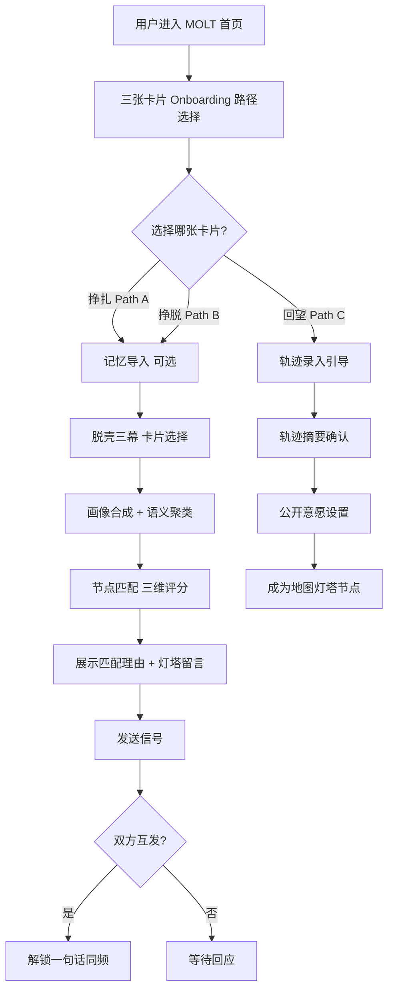

# MOLT（脱壳）- 产品需求文档（PRD）

## 0. 文档信息

### 0.1 文档状态

- **当前版本**: `v3.2 Full`
- **当前阶段**: `Hackathon Demo 完成 / 种子用户验证准备中`
- **创建人**: `王文钦 Ellie`
- **创建日期**: `2026-03-19`
- **最后更新**: `2026-03-29`
- **核心干系人**: `产品、前端、后端、AI工程、设计、测试、路演/运营负责人`

---

### 0.2 更新记录

| 版本号 | 版本状态 | 更新人 | 更新日期 | 核心更新内容 |
| ------ | -------- | ------ | -------- | ------------ |
| 0.1 | 概念草稿 | 王文钦 Ellie | 2026-03-19 | 完成产品愿景、用户痛点、三层架构、MVP范围定义 |
| 1.0 | 需求初稿 | Codex | 2026-03-19 | 按标准 PRD 模板重构文档，补充背景、目标、用户故事、需求列表 |
| 2.0 | 开发交付稿 | Codex | 2026-03-19 | 补充功能流程、边缘 Case、非功能需求、埋点、上线与灰度计划 |
| 2.1 | 评审修订稿 | Codex | 2026-03-19 | 根据评审收窄 Hackathon MVP、补充 AI 降级、外部数据方案、接口契约与技术选型 |
| 2.2 | 配套文档补全稿 | Codex | 2026-03-19 | 补充立项说明、交互原型、UI 设计说明、技术方案文档，并更新引用 |
| 2.3 | 评审闭环修订稿 | Codex | 2026-03-19 | 修正技术栈残留表述，补充评审问题 closure 文档 |
| 2.4 | 技术栈调整稿 | Codex | 2026-03-19 | 按当前方案保留 Redis 表述，并维持其为非本轮必须组件 |
| 2.5 | 决策口径统一稿 | Codex | 2026-03-19 | 清理执行层面的模糊措辞，统一做与不做的决策表达 |
| 2.6 | AI 服务兼容稿 | Codex | 2026-03-19 | 将 AI 服务调整为 Claude API 与 OpenAI API 双兼容方案 |
| 2.7 | AI Provider 配置稿 | Codex | 2026-03-19 | 明确通过 .env 统一配置 AI Provider、API URL、API Key 与模型 |
| 2.8 | Agent LLM 边界稿 | Codex | 2026-03-19 | 明确 Agent 哪些步骤调用 LLM，哪些步骤使用规则与工具完成 |
| 2.9 | Agent 配置化评分稿 | Codex | 2026-03-19 | 将 Agent 从硬编码打分改为配置化特征评分与 Top K rerank |
| 2.10 | Function Calling 设计稿 | Codex | 2026-03-19 | 补充 Agent 的 LLM 可调用 tools、schema 与调用顺序 |
| 2.11 | Orchestrator 收敛稿 | Codex | 2026-03-19 | 移除动态 tool calling，统一为手写 orchestrator + 内部工具 + LLM 任务 |
| 2.12 | 评审对齐修订稿 | Codex | 2026-03-19 | 对齐 R007 状态、收敛 Agent 命名、补充终端详细日志要求与开发优先级说明 |
| 2.13 | Onboarding 三路径集成稿 | 王文钦 Ellie | 2026-03-20 | 集成三张卡片选择式 Onboarding 设计，补充 Path A/B/C 差异化交互逻辑、镜子专属版本、Agent 匹配专属文案、埋点事件与接口字段 |
| 3.0 | 产品定位升级稿 | 王文钦 Ellie | 2026-03-29 | 产品定位从"身份过渡期社区"精确为"AI驱动的求职节点社交平台"；补充参赛赛道与团队信息 |
| 3.1 | 四大创新补全稿 | 王文钦 Ellie | 2026-03-29 | 补充跨AI记忆迁移、语义聚类匹配、情感安全AI社交、叙事驱动AI流程四大核新说明 |
| 3.2 | 架构与Agent全面重构稿 | 王文钦 Ellie | 2026-03-29 | 将脱壳三幕从文字输入改为LLM动态卡片选择；将技术架构迁移至Supabase Edge Functions；补充ARG推理架构、六层画像字段体系、算力成本模型、商业化路径 |

---

### 0.3 相关文档

- **参赛说明 / Pitch Deck**: `MOLT_AI驱动的求职节点社交平台.md`
- **项目立项书**: `MOLT_Hackathon_Project_Charter.md`
- **Onboarding 交互设计**: `MOLT_Onboarding_Design.md`
- **交互原型**: `MOLT_Interaction_Wireframes.md`
- **UI设计稿**: `MOLT_UI_Design_Guide.md`
- **数据埋点需求文档**: `本 PRD 第 3.5 节`
- **技术方案设计文档**: `MOLT_Technical_Design.md`

---

### 0.4 名词解释

| 术语 | 解释 |
| ---- | ---- |
| **MOLT** | 产品名，意为"脱壳"，指人在职业迁移中的重塑过程 |
| **脱壳三幕** | 核心交互形式：三轮卡片选择，每轮5-6张LLM动态生成卡片，全程零文字输入，约65秒完成画像构建 |
| **三张卡片** | Onboarding 第一屏的路径分流选择，用户认出自己后进入对应路径 |
| **挣扎（Path A）** | 第一张卡片：知道方向要变但不知道下一步在哪里 |
| **挣脱（Path B）** | 第二张卡片：已经在行动但不确定方向是否正确 |
| **回望（Path C）** | 第三张卡片：已走出过渡期，愿意将轨迹留给后来者 |
| **记忆导入** | 可选步骤：用户将预设prompt发给自己的AI助手（ChatGPT/Claude/豆包等），粘贴回复，MOLT Agent解析为结构化画像 |
| **跨AI记忆迁移** | 创新一：绕过冷启动，利用用户与其他AI已建立的信任关系快速构建初步画像 |
| **ARG** | Agent推理架构（Agent Reasoning Graph）：先看记忆→再补理解→最后做判断 |
| **MOLT Profile** | 用户结构化画像，包含六层字段（身份基础/焦虑图谱/能力资产/方向意图/人格特质/时序轨迹） |
| **异时态语义匹配** | 创新二：比较用户"现在"与候选灯塔"过去"的向量相似度，实现时序互补匹配 |
| **灯塔节点** | Path C 用户在系统中形成的公开轨迹节点，供 Path A/B 用户匹配参考 |
| **Signal（信号）** | 替代点赞的轻互动行为，表示"我看见了你"，首次接触不暴露任何个人信息 |
| **同频** | 双方互发信号后，系统允许交换一句结构化短消息 |
| **时间胶囊** | 后续版本：对用户当前状态做快照，在未来指定时间回访其变化 |
| **DISPLACE** | 冲击式入口与能力重估模块（v2.x 遗留名称，v3.x 已融入 MOLT Profile 与匹配结果页） |
| **profileFields** | 每张脱壳卡片背后携带的结构化画像字段映射 |
| **三维评分引擎** | Agent匹配算法：画像语义相似度50% + 时序匹配度30% + 方向匹配度20% |

---

## 一、需求背景与目标

### 1.1 项目概述

MOLT 是一个 AI 驱动的求职节点社交平台。参赛赛道：**AI求职社交与网络 × AI求职心理与支持**。产品框架：进化型（创造全新的可能性）+ 体验型（让过程更有尊严）。

团队：王文钦（PM/队长）· 王晗宇（北航）· 曹梦怡（国科大）· 黎汪琦（北理工）· 范芳菲（中科大）

MOLT 以 AI 作为识别和编排系统，以真实用户轨迹作为内容核心。在你求职最迷茫的时刻，AI 不是给你一份简历模板，而是找到一个"三个月前和你一样焦虑、现在已经拿到 Offer"的人，把 TA 带到你面前。不推荐岗位，推荐人；不给答案，给一个走过这条路的真人。

---

### 1.2 要解决的核心问题（Problem Statement）

**背景数据（50名高校学生访谈）：**
- 75% 存在求职焦虑
- 65% 职业方向迷茫
- 55% 担忧 AI 冲击就业
- 80% 就业信心不足

**焦虑类型分布：** AI替代焦虑 35%、方向不确定 25%、投递无回应 20%、能力不匹配 15%、其他 5%

**被忽略的问题：**
- 求职焦虑的核心往往不是效率问题，而是**信心问题**
- LinkedIn 连接"你已经是谁"，不连接"你正在经历什么"
- 小红书能看到故事，但没人来找你
- 心理咨询 App 帮你和自己对话，不帮你和真人连接
- **没有产品在做：基于求职节点的共鸣，把正在迷茫的人和走过同样路的人连在一起**

**核心痛点：**
1. **身份认同受损**：面对专业缩招、岗位收缩、AI替代讨论时，首先崩塌的往往是"我是谁、我还能去哪里"
2. **现有产品只提供信息，不提供连接**：工具类App给内容，但不能基于同类经历形成持续关系
3. **缺乏真实轨迹**：用户需要看到真实他人如何迁移，而非消费内容或与大模型单轮对话
4. **传统社交门槛高且无结构**：脆弱状态下的陌生人即时聊天易让用户进一步退缩

---

### 1.3 用户故事（User Stories）

- **故事一（Path A）**: 作为一名被 AI 冲击的应届毕业生，我想用一种不被审判的方式说出困惑，以便先确认我的问题是具体且被看见的
- **故事二（Path B）**: 作为一名正在转方向的学生，我想看到与我处在相似节点的人后来走向了哪里，以便判断自己不是孤立个体并获得现实参考
- **故事三（Path C）**: 作为一名已完成转型的前辈，我想公开自己的过渡轨迹并对后来者发出信号，以便让经验以更真实、更有温度的方式被复用
- **故事四（通用）**: 作为一名求职焦虑中的用户，我想在不填写任何表格的情况下，通过三次点击让系统理解我，以便获得精准匹配而不是泛泛建议
- **故事五（通用）**: 作为一名愿意连接但不想低质量社交的人，我想通过 Agent 守门确保每次连接都有意义，以便降低社交负担并提高连接质量

---

### 1.4 项目目标与价值

**用户价值：**
1. 30秒内让系统读懂你（跨AI记忆迁移 + 三幕卡片选择）
2. 让用户看到真实同类人的迁移路径，降低孤独感
3. 用结构化低门槛连接，替代无目的闲聊
4. Agent 守门保护脆弱用户不被低质量社交伤害

**商业价值：**
1. 建立基于真实轨迹的独特数据资产（无法爬取、无法合成）
2. C端免费、B端付费（高校就业指导中心、求职平台）
3. 形成"AI匹配能力 + 真实轨迹数据"的差异化平台壁垒

**项目目标（SMART）：**
- **[S]**: 完成 Hackathon Demo，打通"卡片路径选择 → 记忆导入（可选）→ 脱壳三幕 → 画像合成 → 节点匹配 → 信号连接"完整演示闭环
- **[M]**: 三幕完成率 ≥75%，匹配点击率 ≥60%，首次连接触发率 ≥35%
- **[A]**: 基于 React + TypeScript + Tailwind CSS + Supabase + Claude API/OpenAI API + 预生成种子数据完成 Demo 级稳定交付
- **[R]**: 与产品核心定位"AI驱动的求职节点社交"高度一致
- **[T]**: `2026-03-20` 路演前完成 MVP 交付

---

### 1.5 需求范围

**In-Scope（范围内）：**
1. **三张卡片 Onboarding 路径选择**（挣扎 / 挣脱 / 回望）
2. **记忆导入**（可选）：预设 prompt + 粘贴回复 → Agent 解析为结构化画像
3. **脱壳三幕**：三轮 LLM 动态卡片选择，零文字输入，约65秒完成画像
4. **画像合成**：结构化字段 → 自然语言 → 1536维向量嵌入
5. **语义聚类**：告知用户"你和 X 人正在经历类似转变"
6. **节点匹配**：三维评分引擎找到"曾和你相似、已走出来"的灯塔用户
7. **信号连接**：发送信号 → 双方互发后解锁一句话交换
8. **Path C 灯塔建档**：轨迹录入、摘要确认、公开意愿设置
9. Demo 级地图可视化（31个种子灯塔节点）
10. 基础埋点、AI降级兜底和演示脚本

**Hackathon MVP 核心路径（必须跑通）：**
1. 三张卡片路径选择
2. 脱壳三幕卡片选择（三次点击完成画像）
3. 画像合成 + 语义聚类展示
4. 节点匹配 + 匹配理由 + 灯塔留言
5. 信号发送

**Hackathon 加分项（已全部达成）：**
1. 可运行 Demo（完整 Web 应用）✅
2. 真实用户验证（≥3名用户完整反馈）✅
3. 技术复杂度（多模型协作 + 向量匹配 + 时序引擎）✅
4. 开源贡献（GitHub 公开仓库，MIT协议）✅

**Out-of-Scope（范围外）：**
1. 完整即时通讯系统
2. 大规模真实用户审核、举报、风控体系
3. DISPLACE 置换压力指数（已融入画像合成结果展示，不单独维护）
4. 招聘平台正式 API 商业接入
5. 多端原生 App 发布
6. 复杂推荐算法和长期留存策略

---

### 1.6 需求列表（Requirements List）

| 需求ID | 模块 | 需求描述 | 优先级 | 状态 | 备注 |
| ------ | ---- | -------- | ------ | ---- | ---- |
| R000 | Onboarding 卡片 | 用户通过三张卡片完成路径选择（挣扎/挣脱/回望） | 高 | 完成 | 所有后续流程的分流入口 |
| R001 | 记忆导入 | 用户将预设 prompt 发给 AI 助手，粘贴回复，Agent 解析为结构化画像 | 中 | 完成 | 可选步骤，绕过冷启动 |
| R002 | 脱壳三幕 | 三轮 LLM 动态卡片选择，每幕5-6张，全程零文字输入，约65秒 | 高 | 完成 | 替代 v2.x 的文字追问模式 |
| R003 | 画像合成 | 结构化字段 → 自然语言 → 1536维向量嵌入 | 高 | 完成 | `/api/profile-synth` |
| R004 | 语义聚类 | 将用户归入节点群并展示群体规模 | 中 | 完成 | 告知"你不孤独" |
| R005 | 节点匹配 | 三维评分引擎（语义50%+时序30%+方向20%）找到灯塔用户 | 高 | 完成 | 核心闭环 `/api/match` |
| R006 | 匹配展示 | 展示匹配理由 + 灯塔留下的那句话 | 高 | 完成 | 核心价值呈现 |
| R007 | 信号功能 | 用户向灯塔发送"我看见了你"信号 | 中 | 完成 | 前端本地状态 + 数据库记录 |
| R008 | 同频一句话 | 互发信号后允许交换一句结构化消息 | 低 | 规划中 | 非路演必须 |
| R009 | 时间胶囊 | 封存当前状态，未来回访变化 | 低 | 规划中 | 后续版本 |
| R010 | Path C 轨迹建档 | 轨迹录入、摘要确认、公开意愿设置，成为灯塔节点 | 中 | 完成 | 31个种子节点基础上扩展 |
| R011 | 地图可视化 | 展示节点分布与轨迹（种子数据31节点） | 中 | 完成 | 静态种子数据 |
| R012 | ARG 推理架构 | Agent 先检索已有画像→不足则补全→最后匹配 | 高 | 完成 | 替代 v2.x 的 orchestrator 描述 |

---

## 二、方案概述

### 2.1 核心业务流程图（Business Flow）



---

### 2.2 用户旅程全景

```
① 路径选择 —— 从三张卡片中认出自己的状态
    · 挣扎（Path A）— "我知道方向要变，但不知道下一步在哪里"
    · 挣脱（Path B）— "我已经在行动了，但不确定方向对不对"
    · 回望（Path C）— "我走出来了，想让后来的人少走弯路"

② 记忆导入（可选）—— 30秒让AI读懂你
    把一段预设prompt发给常用AI助手（ChatGPT/Claude/豆包/Kimi），
    粘贴回复，MOLT的Agent即刻建立初步画像。

③ 脱壳三幕 —— 三次点击完成画像
    三轮交互式卡片选择，每轮5-6张LLM动态生成的卡片：
    · 第一幕「壳在哪里裂开的」→ 识别焦虑类型
    · 第二幕「壳下面是什么」  → 识别真实状态
    · 第三幕「新壳开始硬化」  → 识别方向意图
    全程3次点击，约65秒，零文字输入。

④ 画像合成 + 语义聚类 —— AI看见了你
    Agent合成自然语言画像，向量化后进行语义聚类，
    告诉你："你和另外47个人正在经历类似的转变。"

⑤ 节点匹配 —— 找到那个走过这条路的人
    Agent在候选池中找到"曾和你处于同一节点、现在已走出来的人"，
    展示匹配理由 + 那个人留下的一句话。

⑥ 连接 —— 从信号到对话
    发送"我看见了你"的信号 → 双方互发后解锁一句话交换 → 逐步建立真实连接。
```

---

### 2.3 信息架构图（IA）

- **首页 / Landing**
  - 产品宣言
  - 开始入口按钮
  - 产品价值说明

- **Onboarding 卡片选择页**
  - 卡片一：挣扎（Path A）
  - 卡片二：挣脱（Path B）
  - 卡片三：回望（Path C）
  - 兜底入口：「都有一点，但又不完全是」→ 默认进入 Path A

- **记忆导入页（可选，Path A/B）**
  - 预设 prompt 展示（可复制）
  - 粘贴回复输入框
  - 跳过按钮

- **脱壳三幕页（Path A/B）**
  - 第一幕「壳在哪里裂开的」：5-6张 LLM 动态卡片
  - 第二幕「壳下面是什么」：5-6张 LLM 动态卡片
  - 第三幕「新壳开始硬化」：5-6张 LLM 动态卡片
  - 幕间叙事动画（"裂缝正在扩大..."）

- **画像展示页（Path A/B）**
  - 自然语言画像摘要
  - 语义聚类群体信息
  - 匹配结果卡（灯塔节点 + 那句话）
  - 信号发送按钮

- **轨迹录入页（Path C）**
  - Q1：过渡前在哪里
  - Q2：转折是怎么发生的
  - Q3：对六个月前的自己说一句话
  - 轨迹摘要卡确认
  - 公开意愿设置
  - 灯塔建档完成页

- **地图页**
  - 节点分布
  - 轨迹路径
  - 节点详情抽屉

- **未来扩展**
  - 时间胶囊
  - 个人轨迹档案
  - MOLT API 开放平台

---

## 三、细节方案

### 3.1 功能详述：Onboarding 与记忆导入

#### 3.1.0 Onboarding 卡片选择页

**交互逻辑：**
1. 用户进入首页后，点击开始按钮进入 Onboarding 卡片选择页
2. 页面展示三张卡片，每张是一段话：

**卡片一：挣扎（Path A）**
```
「我知道自己的专业要消失了
  但我不知道下一步在哪里」

我有点像这个 →
```

**卡片二：挣脱（Path B）**
```
「我已经在行动了，但不确定
  自己走的方向对不对」

我有点像这个 →
```

**卡片三：回望（Path C）**
```
「我走出来了，但我想让
  后来的人少走弯路」

我有点像这个 →
```

**兜底入口**（三张卡片下方）：
```
都有一点，但又不完全是 → 默认进入 Path A
```

**选择逻辑：**
- 用户选择卡片后，`pathType` 写入 session
- Path C 不进入脱壳三幕，单独进入轨迹建档流程
- 未选中卡片触发碎裂动画（呼应"旧壳脱落"叙事）

**数据输出：** `session_id`、`pathType: A | B | C`、时间戳

---

#### 3.1.1 记忆导入（可选步骤，Path A/B）

**交互逻辑：**
1. 进入记忆导入页面，展示预设 prompt（可一键复制）
2. 用户将 prompt 发给自己的 AI 助手（ChatGPT/Claude/豆包/Kimi 等）
3. 将 AI 助手回复粘贴到输入框
4. 点击「让它说」，MOLT Agent 解析回复为结构化画像
5. 也可点击「跳过，直接开始」

**预设 prompt 示例：**
```
你了解我已经有一段时间了。请用200字以内帮我总结：
- 我现在的专业/职业背景
- 我最近在焦虑什么
- 我在往哪个方向探索
- 我的性格特点和做事风格
用第一人称写，就像你是我，在对别人介绍自己。
```

**Agent 解析逻辑：**
- LLM prompt 约束输出为严格 JSON，包含置信度评分
- 低置信度字段标记为"待确认"，在脱壳三幕中优先采集
- 单次调用约800 tokens

**技术接口：** `POST /api/memory-import`

**降级策略：**
- AI 解析失败时提示用户跳过，直接进入脱壳三幕
- 不阻断主流程

---

#### 3.1.2 脱壳三幕（Path A/B）

**叙事隐喻：** 壳裂开（识别焦虑）→ 壳下面是什么（识别真实状态）→ 新壳硬化（识别方向）

**交互形式：** 每幕5-6张 LLM 动态生成卡片，用户点击选择，全程零文字输入

**为什么用卡片选择而非文字输入：**
- 求职焦虑状态下用户往往"说不出来"
- 在别人的话里认出自己，心智成本极低
- 每张卡片背后携带 `profileFields` 结构化字段——每次点击都在无感知地完成画像构建

**为什么全程 LLM 动态生成：**
- 每幕的卡片由 LLM 根据前序选择 + 导入记忆实时定制
- 每个用户看到的题目都不一样
- 同一个数据采集任务，叙事包装改变了用户的心理感受

**第一幕「壳在哪里裂开的」→ 识别焦虑类型**

LLM 出题指令：
- 叙事指令："用两行≤12字的短句描述一种求职焦虑场景，语气是猜测而非诊断"
- 采集指令："这张卡片必须在 profileFields 中填充 `anxiety_type` 和 `major_field` 字段，值必须从指定词表中选取"

示例卡片：
```
「我学的东西好像突然没人要了」
「AI做的事和我做的事越来越像了」
「投了很多简历，没有一个回音」
「不知道自己的专业还值不值得继续」
「感觉大家都在转，就我还在原地」
「好像有什么东西悄悄消失了」
```

**第二幕「壳下面是什么」→ 识别真实状态**

示例卡片（根据第一幕动态定制）：
```
「其实我知道还有用，但我怕别人觉得没用」
「我想转，但不知道往哪里转」
「我在悄悄尝试，但不敢告诉别人」
「我有想法，但不知道怎么开始」
```

**第三幕「新壳开始硬化」→ 识别方向意图**

示例卡片：
```
「我想找一个真的走出来的人聊聊」
「我想知道我的经历对别人有没有价值」
「我想验证一下自己的判断对不对」
「我想要一个不评判我的地方说说心里话」
```

**幕间动画：**
- "裂缝正在扩大..." → 遮盖 LLM 出题的1-2秒延迟
- 选中卡片后其他卡片碎裂飘散
- 三幕后碎片飞向中央拼合成画像

**技术接口：** `POST /api/molt-cards`（每幕调用一次）

---

#### 3.1.3 Path C（回望）：轨迹录入与灯塔建档

**语气基调：郑重、受邀、有仪式感**

页面首先展示：
```
你走出来了。

但你走过的这条路，还有人不知道它存在。

MOLT 想把你的轨迹变成地图上的一条路径——
不是成功学故事，是一段真实的「从这里，到那里」。

愿意说说吗？
```

**Q1（固定）：**
> 「在你开始感到不确定之前，你在哪里？」
> *「说说当时的专业 / 职业 / 状态，一两句就够。」*

**Q2（固定）：**
> 「转折是怎么发生的？有没有一个具体的时刻或决定？」

**Q3（固定）：**
> 「现在的你，想对六个月前的自己说一句什么话？」
> *Q3 的原话将成为灯塔节点上展示给其他人看的那句话。*

**轨迹摘要卡确认：**
```
你的过渡轨迹——

起点：___（从 Q1 提取）
转折：___（从 Q2 提取）
现在：___（系统基于整体推断）

你想对后来的人说：「___」（来自 Q3 原话）

这是你的轨迹，准确吗？
```
- 主按钮：**「是的，这就是我的路」**
- 次按钮：**「我来补充一些细节」**

**公开意愿设置：**
```
○ 完整展示（轨迹起点、转折、现状、那句话）
○ 只展示方向和那句话
○ 只展示「曾经在这里，现在走出来了」
```

**灯塔建档完成页：**
```
你现在是地图上的一个灯塔。

当有人和六个月前的你处于同一位置时，
MOLT 会在合适的时候，把你的轨迹展示给他们。

他们不会知道你的名字，
但他们会看见你走过的路。

你的那句话已经在等他们了——
「___」（用户 Q3 的原话）
```

---

#### 3.1.4 通用降级策略

- AI Provider 超时阈值：`8 秒`，单节点最多重试 `1 次`
- AI 服务通过 `.env` 统一配置：`AI_PROVIDER`、`AI_API_URL`、`AI_API_KEY`、`AI_MODEL`
- **每条路径（A/B）均需预置至少 `3 组` 降级卡片模板**，保证路演可继续
- 路演模式（`DEMO_MODE=true`）为指定账号直接返回对应路径的预设结果
- **降级卡片池**：LLM 不可用时，三幕使用预设静态卡片，核心流程不中断

---

### 3.2 功能详述：画像合成与节点匹配

#### 3.2.1 画像合成

**输入：** 脱壳三幕的 `profileFields` 聚合 + 记忆导入结果（如有）

**Agent 处理流程（ARG 架构）：**
1. **检索已有画像**：查询 MOLT Profile，评估完整度与置信度
2. **画像补全**（如需）：利用弱信号推断，或触发外部信息补全
3. **合成自然语言描述**：结构化字段 → 自然语言
4. **向量嵌入**：通过 `text-embedding-3-small` 生成1536维向量
5. **写入数据库**：更新 user profile，存储向量

**技术接口：** `POST /api/profile-synth`

**语义聚类展示：**
- 将用户归入语义节点群（如"文科 × AI焦虑 × 产品方向"）
- 告知用户："你和另外 X 个人正在经历类似的转变，其中 Y 人已经走出来了"

---

#### 3.2.2 节点匹配（三维评分引擎）

**匹配逻辑（异时态语义匹配）：**
- 比较用户"现在"的向量与候选灯塔"过去"的历史节点向量
- 找的不是"你像谁"，而是"谁曾经像你"

**三维评分引擎：**

| 维度 | 权重 | 逻辑 |
|------|------|------|
| 画像语义相似度 | 50% | 用户向量与候选灯塔历史节点向量的余弦距离 |
| 时序匹配度 | 30% | 候选人走出 crisis 节点的时间越近分越高（≤3月=满分） |
| 方向匹配度 | 20% | 探索方向是否一致 |

**匹配结果展示：**
- 匹配理由（个性化生成）
- 灯塔用户留下的"那句话"（来自 Path C Q3）
- 信号发送按钮

**技术接口：** `POST /api/match`

**Agent 分工：**
- `filter_candidates`、`rank_candidates`：规则 + 配置（不调用 LLM）
- `generate_match_reason`：调用 LLM 生成个性化理由

---

#### 3.2.3 信号与同频

**信号机制：**
- 用户对匹配节点发送"我看见了你"信号
- 首次接触不暴露任何个人信息
- 灯塔用户收到信号后可选择回应

**同频解锁：**
- 双方互发信号后解锁"一句话交换"
- Agent 提供消息模板降低社交压力
- 严格限制一句话，避免演变为即时通讯工具

---

#### 3.2.4 边缘 Case 处理

- 匹配不到合适对象时，展示公开轨迹替代一对一连接
- 用户不愿公开完整轨迹时，只展示抽象节点信息
- 对话中出现危机信号时，停止匹配，提示专业资源
- 信号发送失败时保留前端状态并支持重试

---

### 3.3 功能详述：Path C 灯塔与地图

#### 3.3.1 地图可视化

- Hackathon 阶段使用 31 个预设种子灯塔节点（静态 JSON）
- 展示节点分布、相似人群聚类、轨迹路径
- 节点按职业方向、转型阶段、城市分类显示
- 点击节点可查看简化轨迹信息

---

### 3.4 非功能性需求

**性能需求：**
- 脱壳三幕每幕卡片生成：1-2秒（叙事动画遮盖延迟）
- 画像合成与向量嵌入：≤3秒
- 节点匹配（向量计算）：≤1秒（种子数据预计算）

**算力约束：**
- 单用户约5,000 tokens，5-7次 LLM 调用
- Demo 月成本 <¥1，种子期500用户 <¥40

**兼容性需求：**
- 优先适配桌面 Chrome 最新两个版本
- 兼容移动端 H5 主流 WebKit/Chrome 内核浏览器

**安全与隐私需求：**
- 用户自白默认视为敏感文本，未经确认不得公开展示
- 地图中默认展示抽象节点，不展示真实姓名、完整履历、联系方式
- 所有连接需双向同意，Agent 不单方面暴露用户信息
- 不做心理诊断，只识别节点状态
- 出现危机信号时停止匹配，提示专业资源

---

### 3.5 数据统计 / 埋点需求

| 事件名称 | 触发时机 | 页面/位置 | 上报参数 | 备注 |
| -------- | -------- | --------- | -------- | ---- |
| `view_landing_page` | 打开首页时 | 首页 | `session_id` | PV |
| `click_start_molt` | 点击开始按钮时 | 首页 | `session_id` | 入口点击 |
| `view_onboarding_cards` | 进入三张卡片页时 | Onboarding 页 | `session_id` | |
| `select_onboarding_card` | 用户点击三张卡片之一 | Onboarding 页 | `session_id`, `path_type: A/B/C` | 分流关键点 |
| `select_fallback_path` | 点击「都有一点」兜底入口 | Onboarding 页 | `session_id` | |
| `view_memory_import` | 进入记忆导入页 | 记忆导入页 | `session_id`, `path_type` | |
| `submit_memory_import` | 粘贴回复并提交 | 记忆导入页 | `session_id`, `text_length` | 不上报原文 |
| `skip_memory_import` | 点击跳过 | 记忆导入页 | `session_id` | |
| `view_molt_act` | 进入每一幕 | 脱壳三幕页 | `session_id`, `act_index: 1/2/3` | |
| `select_molt_card` | 用户点击选择卡片 | 脱壳三幕页 | `session_id`, `act_index`, `card_index`, `anxiety_type` | 无感画像采集 |
| `view_profile_result` | 展示画像合成结果时 | 画像展示页 | `session_id`, `cluster_size` | |
| `view_match_result` | 展示节点匹配结果时 | 画像展示页 | `session_id`, `target_node_id`, `match_score` | |
| `click_send_signal` | 点击发送信号时 | 画像展示页 | `session_id`, `target_node_id` | |
| `signal_unlock_chat` | 双方互发信号解锁同频 | 连接页 | `session_id`, `target_node_id` | |
| `become_lighthouse` | Path C 完成灯塔建档 | 建档完成页 | `session_id`, `visibility_level` | Path C 专属 |

---

## 四、上线计划与运营

### 4.1 商业化路径（Roadmap）

| 阶段 | 时间 | 关键动作 | 核心 KPI |
|------|------|---------|---------|
| Hackathon Demo | 2026-03-20 | 路演演示完整链路 | 链路稳定率 ≥90% |
| 种子用户验证 | 0-3个月 | 5所高校冷启动，500名种子用户，建立100人灯塔池 | 三幕完成率≥75%，匹配点击率≥60% |
| 高校扩展 | 3-6个月 | 覆盖20所高校，签约3个就业中心 | 首次连接触发率≥35% |
| 品类扩展 | 6-12个月 | 从求职扩展到考研、留学、转行、创业 | 有效对话率≥20% |
| 平台化 | 12个月+ | 开放 MOLT API，接入第三方求职/教育平台 | B端签约客户 |

### 4.2 商业模式

**C端免费，B端付费，数据驱动飞轮：**

- **C端（免费）：** 脱壳三幕、匹配推荐、信号连接
- **B端（付费）：**
  - 高校就业指导中心：年费订阅"节点匹配引擎"、匿名就业洞察报告
  - 求职平台：API集成MOLT匹配能力、差异化"求职社交"功能

### 4.3 灰度发布计划

- **第一阶段**（2026-03-20）：仅面向内部演示与评委体验
- **第二阶段**（2026-03-21 ~ 2026-03-27）：邀请少量真实目标用户封闭测试
- **第三阶段**（待定）：根据反馈逐步扩展至公开体验版本

---

## 五、附录

### 产品宣言

你不是被时代淘汰的人。你是正在换壳的人。

---

### 产品不是什么

1. 不是求职效率工具，不提供流水线式求职建议清单
2. 不是内容平台，不鼓励通过刷内容获得"被安慰"的错觉
3. 不是即时通讯工具，对话必须有结构、有门槛、有目的
4. 不展示成功学履历，重点展示真实过渡轨迹
5. 不撒鸡汤，不消除恐惧，而是让恐惧被看见、被命名、被连接

---

### 四大 AI 创新

| 创新 | 核心概念 | 技术差异点 |
|------|---------|-----------|
| 跨AI记忆迁移 | 从用户已有AI助手搬运记忆，绕过冷启动 | 目前无产品级实现 |
| 语义聚类匹配 | 异时态匹配：用户"现在"vs候选人"过去" | 推荐系统文献中的空白 |
| 情感安全AI社交 | Agent作为守门人，渐进式连接机制 | 保护脆弱用户不被低质量社交伤害 |
| 叙事驱动AI流程 | 技术架构服务于脱壳叙事隐喻 | 叙事包装改变用户心理感受 |

---

### 技术架构概要

- **用户交互层：** React + TypeScript + Tailwind CSS
- **服务逻辑层：** Supabase Edge Functions（无服务器）
- **数据存储层：** PostgreSQL（Supabase）+ 种子 JSON 文件 + LocalStorage（会话状态）
- **AI 层：** Claude Sonnet / OpenAI（通过 `.env` 双兼容）
- **向量引擎：** text-embedding-3-small（1536维）+ 余弦相似度
- **核心 API：** `/api/memory-import`、`/api/molt-cards`、`/api/profile-synth`、`/api/match`

---

### 用户画像字段体系（六层）

| 层级 | 字段示例 | 采集来源 | 聚类用途 |
|------|---------|---------|---------|
| 身份基础层 | 学历阶段、专业领域、职业状态 | 记忆导入 + 三幕推断 | 粗粒度分群 |
| 焦虑图谱层 | 核心焦虑类型、焦虑持续时长 | 第一幕卡片 tags | 最强聚类信号 |
| 能力资产层 | 硬技能、软实力、被低估能力 | 记忆导入 + 简历导入 | 精准方向匹配 |
| 方向意图层 | 探索方向、行动阶段、期望帮助 | 第二三幕卡片 tags | 时序匹配坐标 |
| 人格特质层 | 决策风格、社交偏好、沟通风格 | 记忆导入推断 | 连接质量优化 |
| 时序轨迹层 | 节点序列（crisis→exploring→landed） | 全流程累积 | 轨迹模式发现 |

---

### 接口契约（v3.2 Draft）

```ts
// 记忆导入
interface MemoryImportRequest {
  sessionId: string;
  pathType: 'A' | 'B';
  rawText: string; // 用户粘贴的 AI 助手回复
}

interface MemoryImportResponse {
  sessionId: string;
  profileFields: Partial<MOLTProfile>;
  confidenceScores: Record<string, number>;
  fallbackUsed: boolean;
}

// 脱壳三幕出题
interface MoltCardsRequest {
  sessionId: string;
  actIndex: 1 | 2 | 3;
  previousSelections?: CardSelection[]; // 前序选择（用于动态定制）
  memoryProfile?: Partial<MOLTProfile>; // 记忆导入结果（如有）
}

interface MoltCardsResponse {
  cards: Array<{
    text: string;           // 卡片展示文案（两行≤12字）
    profileFields: Record<string, string>; // 对应的画像字段映射
  }>;
  fallbackUsed: boolean;
}

// 画像合成
interface ProfileSynthRequest {
  sessionId: string;
  selections: CardSelection[]; // 三幕所有选择
  memoryProfile?: Partial<MOLTProfile>;
}

interface ProfileSynthResponse {
  sessionId: string;
  naturalLanguageProfile: string;   // 自然语言画像描述
  embeddingVector: number[];         // 1536维向量
  clusterInfo: {
    clusterLabel: string;           // 如"文科 × AI焦虑 × 产品方向"
    clusterSize: number;            // 群体规模
    landedCount: number;            // 已走出来的人数
  };
  fallbackUsed: boolean;
}

// 节点匹配
interface MatchRequest {
  sessionId: string;
  pathType: 'A' | 'B';
  userVector: number[];
  explorationDirection?: string;
}

interface MatchResponse {
  sessionId: string;
  targetNodeId: string;
  matchScore: number;
  semanticScore: number;   // 语义相似度（50%）
  temporalScore: number;   // 时序匹配度（30%）
  directionScore: number;  // 方向匹配度（20%）
  matchReason: string;     // 个性化匹配理由
  lighthouseMessage: string; // 灯塔留下的那句话
  fallbackUsed: boolean;
}

// Path C 轨迹建档
interface TrajectoryRequest {
  sessionId: string;
  q1: string; // 过渡前在哪里
  q2: string; // 转折是怎么发生的
  q3: string; // 对六个月前的自己说的话（灯塔留言）
}

interface TrajectoryResponse {
  sessionId: string;
  startPoint: string;
  turningPoint: string;
  currentState: string;
  lightMessage: string; // Q3 原话
  visibilityLevel: 'full' | 'partial' | 'minimal';
  nodeId: string;
  fallbackUsed: boolean;
}
```

---

### Hackathon MVP 演示脚本（v3.2）

1. **第 1 分钟**：投屏二维码，引导评委与观众扫码进入首页，展示三张 Onboarding 卡片
2. **第 2 分钟**：选择「挣扎」卡片（Path A），展示记忆导入（粘贴预设回复），完成脱壳三幕三次点击
3. **第 3 分钟**：展示画像合成结果 + 语义聚类信息 + 节点匹配结果（灯塔留言）
4. **最后 30 秒**：点击信号发送，完成产品价值闭环；展示"你和 X 个人正在经历同样的转变"

---

### 核心价值观

1. 被看见比被解决更重要
2. 连接是终点，不是手段
3. 轨迹比结果更有说服力
4. 锋利不等于冰冷
5. Agent守门，保护脆弱者不被低质量连接伤害
